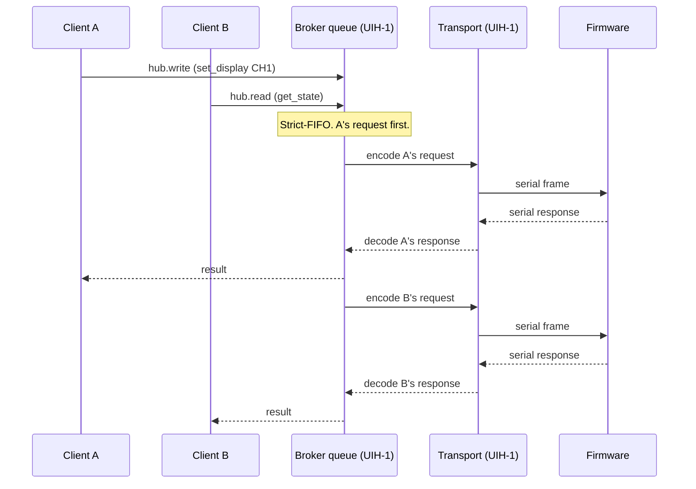

# UIH Broker — Design and Implementation

**Status:** Design
**Date:** 2026-04-28
**Author:** Mat (with Claude as design partner)
**Companion document:** [`2026-04-28-uih-broker-spec.md`](./2026-04-28-uih-broker-spec.md) — context, goals, architectural shape, and decision rationale.

This document is the **low-level design**: wire formats, data shapes, interface contracts, edge cases, and other implementation-level detail. For motivation, goals, and the architectural picture, read the companion specification first.

## Table of Contents

- [Components](#components)
  - [Broker daemon](#broker-daemon)
  - [Enumeration sources (built-in, not plugins)](#enumeration-sources-built-in-not-plugins)
    - [Enumerator interface](#enumerator-interface)
      - [Lifecycle](#lifecycle)
      - [Wire format — child → broker (stdout, NDJSON)](#wire-format--child--broker-stdout-ndjson)
      - [Device shape](#device-shape)
      - [Device IDs](#device-ids)
      - [Augmentation by plugins](#augmentation-by-plugins)
      - [Hub readiness gating](#hub-readiness-gating)
      - [Multi-endpoint devices (PPK2, multi-port FTDI, etc.)](#multi-endpoint-devices-ppk2-multi-port-ftdi-etc)
      - [Wire format — broker → child (stdin, NDJSON)](#wire-format--broker--child-stdin-ndjson)
      - [stderr](#stderr)
      - [Versioning](#versioning)
    - [Optional in-process mode for debugging](#optional-in-process-mode-for-debugging)
    - [Mock enumerator](#mock-enumerator)
  - [Client SDK (`uih-sdk`)](#client-sdk-uih-sdk)
- [Wire protocol](#wire-protocol)
  - [Envelope](#envelope)
  - [Methods (v1)](#methods-v1)
  - [Capability vocabulary](#capability-vocabulary)
  - [Event vocabulary](#event-vocabulary)
  - [Framing](#framing)
- [Concurrency model](#concurrency-model)
  - [Per-device serialization](#per-device-serialization)
  - [Subscription fan-out](#subscription-fan-out)
  - [Binary payloads in single RPCs](#binary-payloads-in-single-rpcs)
  - [Request progress timeout](#request-progress-timeout)
  - [Multi-step exclusive access (`hub.lock`)](#multi-step-exclusive-access-hublock)
  - [Timeouts and retries](#timeouts-and-retries)
  - [Leases](#leases)
- [Plugin SDK](#plugin-sdk)
  - [Tier 1 — high-level](#tier-1--high-level)
  - [Tier 2 — low-level](#tier-2--low-level)
  - [`self.hub` is a schema-driven proxy](#selfhub-is-a-schema-driven-proxy)
  - [Action lifecycle](#action-lifecycle)
- [Security model](#security-model)
  - [v1: local trust](#v1-local-trust)
  - [v2 (deferred): capability tokens](#v2-deferred-capability-tokens)
  - [What the broker can and cannot enforce](#what-the-broker-can-and-cannot-enforce)
  - [Audit log](#audit-log)
- [Migration of `hub_agent.py` — base vs plugin decomposition](#migration-of-hub_agentpy--base-vs-plugin-decomposition)
- [CLI](#cli)
- [References](#references)

## Components

### Broker daemon

A single Python 3.10+ process running per user (the master broker). Responsibilities:

| Component | Responsibility |
|-----------|----------------|
| **IPC server** | Accepts client connections on a unix domain socket (UDS) (`~/.local/state/uih/daemon.sock`) or Windows named pipe (`\\.\pipe\uih-daemon-<user>`). Runs the per-connection handshake, maintains client identity records. |
| **Transport manager** | Owns one `embedded-bridge` `MessageReader/Writer` pair per connected UIH. Supports serial transport (USB CDC) and, in future, WebSocket transport (when firmware exposes it). Detects hot-plug, reconnects on transport drop. |
| **Per-device request queue** | One FIFO queue per UIH. Strict-serialize C2 requests since the firmware lacks correlation IDs. Will pipeline if/when firmware adds them. TODO - afaik, firmware is synchronous? if that's not the case then firmware should at least support correlation IDs in the responses. |
| **Subscription registry** | Maps event topics to a set of subscriber connection IDs with optional filters. Handles fan-out from a single device subscription to multiple clients. |
| **Enumeration sources** | First-party, OS-specific; produce `(kind, device)` events into a unified internal stream. |
| **Action router** | Dispatches `action.invoke:<name>` calls to whichever action-plugin registered the matching `(name, type)` pair. |
| **Plugin registry** | Tracks which connections have called `action.provide` and what they offer. (Not lifecycle management — just routing.) |
| **Audit log** | Writes structured JSONL records of every inbound action to `~/.local/state/uih/audit.jsonl` with rotation. |
| **Lease manager** | Grants connection-scoped leases on devices (hubs and client ports) via `device.checkout`/`device.checkin`. For a hub lease, releases the C2 transport before responding `granted` and reopens on release. On connection disconnect, all leases are released. Emits `hub-disconnected`/`hub-connected` and `device-locked`/`device-unlocked` events. |

### Enumeration sources (built-in, not plugins)

The broker imports a **per-OS Python entry-point module** that is responsible for everything to do with enumeration on that platform — spawning the actual event source, supervising it, and exposing a uniform `Source` interface back to the broker. The broker itself has zero `if sys.platform == ...` branches: it imports `uih_broker.enumerators` and gets the right module for the current OS.

```
uih_broker/enumerators/
├── __init__.py        # Selects the per-OS module by sys.platform
├── base.py            # Source interface; common Subprocess implementation
├── events.py          # Wire-format types (Device, AddedEvent, ChangedEvent, ...)
├── supervisor.py      # Cross-platform: spawn, restart-on-crash, NDJSON I/O, stderr forwarding
├── macos.py           # Per-OS entry point: configures supervisor to launch the macOS worker
├── linux.py           # Per-OS entry point: configures supervisor to launch the Linux worker
├── windows.py         # Per-OS entry point: configures supervisor to launch UIHEnumerator.exe
└── workers/
    ├── macos.py       # Standalone worker script: IOKit watcher → NDJSON to stdout
    └── linux.py       # Standalone worker script: pyudev watcher → NDJSON to stdout
```

The supervisor (process spawn, lifecycle, NDJSON read/write, restart with backoff, stderr capture) is shared across all platforms — there's nothing OS-specific about that work. Each per-OS entry-point module is short, configuring *what* to launch on that OS:

| OS | Per-OS module launches | What gets launched |
|----|-----------------------|---------------------|
| **macOS** | `python -m uih_broker.enumerators.workers.macos` | Python worker. ctypes IOKit bridge for hot-plug; reads BOS descriptors via IOKit and emits `bos_container_id` when present. Ported from the author's prior `hub_agent.py` reference. (Bootloader probing and USB2/USB3 pairing are *not* here — they live in plugins.) |
| **Linux** | `python -m uih_broker.enumerators.workers.linux` | Python worker. `pyudev` for hot-plug events plus sysfs reads for descriptor data; emits `bos_container_id` from the BOS descriptor. Doridian's prior art is the reference for the sysfs reads, but the UIH-specific pairing logic lives in the privileged plugin, not here. |
| **Windows** | `UIHEnumerator.exe` (C# binary, ships alongside the broker) | Refactored from the existing `UIHExtractionService` codebase. Tree-building and per-port categorization are kept. **UIH-specific matching, USB2/USB3 pairing, C2 serial ownership, and display-frame formatting are removed** — pairing moves to the privileged plugin (consuming `bos_container_id`); the broker owns transport. |

The Windows entry-point module is still Python — its job is to know that the worker happens to be a C# binary, locate it, and hand it to the supervisor. The shape of the broker-facing interface is identical on all OSs.

Adding a new OS or alternative enumerator (FreeBSD, network-attached USB hub, a fake for testing) is a matter of dropping in a new entry-point module that conforms to `Source` and points the supervisor at the appropriate worker. No broker changes, and no new supervisor code if the worker uses subprocess + stdout (which it should).

**Fallback enumerator.** A polling fallback ships alongside the per-OS workers: `python -m uih_broker.enumerators.workers.pyserial`. It uses `pyserial.tools.list_ports` to scan for USB CDC devices on a configurable interval (default 2 seconds), comparing snapshots to synthesize `added` / `removed` / `changed` events. It runs anywhere Python + `pyserial` runs (FreeBSD, exotic Linuxes, dev-VMs without proper hot-plug plumbing) and serves as a deployment safety net.

Selectable via `--enumerator pyserial` or `broker.enumerator.kind: pyserial` config; the default remains the per-OS enumerator. Limitations are real and documented up-front:

- **No hot-plug events.** Detection latency is the polling interval — fine for most use cases, poor for "tool that fires when device appears."
- **No `bos_container_id`.** `pyserial` reports CDC ports, not raw USB descriptors. UIH USB2/USB3 pairing degrades — the privileged plugin sees only one of the two halves and can pair only by VID/PID heuristics. Adequate for "the hub is here and driveable"; insufficient for full UIH semantics (`uih.usb2_location`, `uih.usb3_location`, `uih.ports` may be incomplete).
- **No client device descriptors.** Only USB CDC devices appear; HID, mass storage, generic USB devices on the hub's downstream ports are invisible.

Use the fallback for deployment convenience, integration tests, and exotic platforms; expect to upgrade to the per-OS enumerator when hot-plug latency, full topology, or non-CDC client devices matter.

#### Enumerator interface

The contract between an enumerator child process and the broker. Stable across platforms; versioned so v2 additions can be made compatibly.

##### Lifecycle

1. **Spawn.** Broker starts the child with arguments `--protocol-version <N>` and (optionally) `--log-level <level>`. Working directory is the broker's runtime dir. Environment is inherited.
2. **Initial state.** Child immediately emits one `added` event per device currently attached, in any order, then emits a single `synced` event. The broker treats the device list as authoritative only after `synced`.
3. **Steady state.** Child emits `added` / `removed` / `changed` / `error` events as USB topology changes. Coalescing of rapid hot-plug churn is the child's responsibility (the existing C# enumerator's 500ms debounce is the reference behavior).
4. **Shutdown.** Broker sends `{"cmd": "shutdown"}` on stdin. Child has up to `shutdown_grace_s` (default 5s) to exit; broker escalates to SIGTERM, then SIGKILL.
5. **Restart.** On unexpected exit, broker respawns with exponential backoff (1s, 2s, 4s, …, capped at 60s). Each restart begins a new lifecycle from step 2 — the broker reconciles by treating any device not re-emitted in the new initial state as removed.

##### Wire format — child → broker (stdout, NDJSON)

Every line is a single JSON object with a `v` field naming the protocol version and an `event` field naming the event type. The field name `event` matches the broker's outbound event vocabulary (see [Event vocabulary](#event-vocabulary)) so readers handling both layers don't have to remember two discriminator names.

```jsonl
{"v": 1, "event": "added",   "device": { id="...", ...other device details... }}
{"v": 1, "event": "removed", "device_id": "1.10"}
{"v": 1, "event": "changed", "device_id": "20-3.3.4.1", "fields": {"description": "Cypress USB-to-UART"}}
{"v": 1, "event": "synced"}
{"v": 1, "event": "error",   "code": "permission_denied", "message": "IOKit access denied", "fatal": false}
```

| Event | Required fields | Meaning |
|-------|-----------------|---------|
| `added` | `device` (full shape) | New device detected. |
| `removed` | `device_id` | Device no longer present. |
| `changed` | `device_id`, `fields` (subset of mutable device fields) | Existing device's state changed. |
| `synced` | — | Initial-state delivery complete (or, after a rescan, the rescan is complete). |
| `error` | `code`, `message`, `fatal` | Non-fatal: surfaced to clients as a `broker-error` event with `source: "enumerator"`. Fatal: child should exit; broker treats it as a crash and respawns with backoff. |

##### Device shape

Two device types: **hubs** (the UIHs themselves) and **client devices** (anything plugged into a hub's CH1–3). Both share a base shape; type-specific fields are documented per type.

Common fields:

| Field | Required | Set by | Description |
|-------|----------|--------|-------------|
| `id` | yes | enumerator | Stable identifier — see [Device IDs](#device-ids) below. |
| `type` | yes | enumerator | The device's category. One of: `uih`, `cdc`, `hid`, `disk`, `hub`, `generic`. Mostly USB-class-derived; `uih` is the one project-specific exception, applied by the enumerator on a literal VID/PID match (`303A:1001`). The enumerator does not interpret what UIH means — that's the privileged `uih-plugin-detect` plugin's job (USB2/USB3 pairing, C2 path resolution, populating `uih.*`). Other vendor- or product-specific identification (`espressif-native`, `ppk2`, etc.) is a plugin concern, expressed via `tags`/`product`/`extensions` rather than the type taxonomy. |
| `location` | yes | enumerator | OS-stable USB topology path (`20-3.3.4`, `1-1.4.1`, etc.). Used for `device.lock` scoping. |
| `description` | no | enumerator | Free-form human-readable text from the OS. |
| `vid`, `pid` | no | enumerator | USB IDs in hex strings. |
| `serial` | no | enumerator | USB serial number string if exposed by the device. |
| `bos_container_id` | no | enumerator | The 128-bit BOS Container ID descriptor as a hex string, when the device exposes one. Generic USB-3+ infrastructure for relating multiple bus connections of the same physical device. The privileged UIH-detect plugin uses this to pair the USB2 and USB3 halves of the dual-bus controller; PPK2-style multi-endpoint products may also opt to use it. The enumerator is unaware of any product-specific meaning — it just surfaces the descriptor when present. |
| `tags` | no | plugins | List of free-form classification strings. Conventional tags by community agreement (`ppk2`, `esp32-native`, `arduino-1200baud`). Set/extended by tagger plugins via `events.publish device-changed`. |
| `product` | no | plugins | Human-readable product identifier (`"Nordic PPK2"`, `"ESP32-S3-DevKit-C-1"`). Set by tagger plugins. Different from `description` (which is OS-supplied) — `product` is plugin-curated. |
| `extensions` | no | plugins | Object containing all plugin-managed product- or plugin-specific data, keyed by product/family/plugin namespace (`extensions.ppk2`, `extensions.espressif`, `extensions.ftdi_multiport`). See [Augmentation by plugins](#augmentation-by-plugins). |

Hub-specific fields (`type: "uih"`) live in a top-level `uih` object — a **reserved namespace** that only privileged plugins may write to (see [Augmentation by plugins](#augmentation-by-plugins) below for the trust model). The default `uih-plugin-detect` is the privileged plugin that populates these fields after the enumerator labels a device with `type: "uih"`:

| Field | Description |
|-------|-------------|
| `uih.state` | `"running"` once C2 is reachable, `"bootloader"` while the device is in download mode. |
| `uih.c2_path` | OS-specific C2 serial path (`/dev/cu.usbmodemXXX`, `COM5`, `/dev/ttyACM0`). Broker uses this to open the transport. Only present when `uih.state == "running"`. |
| `uih.usb2_location`, `uih.usb3_location` | The two halves of the dual-bus controller, paired by the privileged plugin via BOS Container ID. |
| `uih.ports` | Array of 3 port descriptors: `[{channel: 1, devices: [<device_id>, ...]}, ...]`. |
| `uih.capabilities` | Hardware capability descriptor (firmware revision, port count, display geometry, sensor variants, etc.). Populated by the privileged plugin after a successful capability handshake — the `uih-plugin-detect` plugin issues a `hub.read get_capabilities` RPC over C2 once `c2_path` is established (or reads firmware version from the descriptor's `bcdDevice` if firmware doesn't expose the verb), and writes the result here. Plugins introspect this to adapt to hardware variants — a UIH revision with 4 ports or a different display resolution should not require plugin code changes. Example shape: `{firmware: "1.10", ports: 3, displays: {count: 3, resolution: "226x90", color_depth: 16}, power_monitor: "PAC1953"}`. The structure is firmware-defined; the broker passes it through opaquely. Plugins that depend on a specific capability should validate before use and degrade gracefully when absent. |

Client-device-specific fields:

| Field | Set by | Description |
|-------|--------|-------------|
| `path` | enumerator | OS-specific device file path if applicable (e.g., `/dev/cu.usbmodemY` for serial devices). |
| `extra` | enumerator | Free-form object for OS-specific fields that don't fit elsewhere — e.g., `{"drive_letter": "F:"}` on Windows for `type: "disk"`. Broker passes through unchanged; clients may ignore. |
| `hub_id` | privileged plugin (for UIH-attached devices) | The parent UIH hub's `id` (a location-based ID — hub IDs use the same scheme as all other device IDs). The enumerator only sees the immediate USB topology parent, which on UIHs is the USB2 or USB3 hub component, not the controller chip. The privileged `uih-plugin-detect`, having paired the two halves, normalizes `hub_id` to point at the controller's `id`. Devices attached to non-UIH parents have no `hub_id`. |
| `channel` | privileged plugin (for UIH-attached devices) | 1, 2, or 3. UIH-specific concept; populated by `uih-plugin-detect` from `uih.ports`. |
| `usb_type` | privileged plugin (for UIH-attached devices) | `"2"` or `"3"` — which side of the dual-bus the device is on. Populated by `uih-plugin-detect` after BOS pairing. |

##### Device IDs

The `id` is generated by the enumerator and first transmitted in the `added` event as `device.id`. Subsequent `removed` and `changed` events reference the same value as `device_id` (flat form for concision; the value is identical to whatever was set in `added.device.id`).

The enumerator must compute the ID **deterministically from stable device properties**. The same physical device returning to the same circumstances must always produce the same ID — across detach/reattach, across enumerator restarts, and across broker restarts. The enumerator does *not* persist any ID-mapping state to disk: determinism comes from the inputs, not from memory.

ID-generation rules: **all devices, including UIH hubs, use the USB location path as their ID.** Hubs are not special at the ID level.

| Device | ID source | Example |
|--------|-----------|---------|
| UIH hub | USB location path | `20-3.3.4` |
| Client device | USB location path | `20-3.3.4.1` |

**Why all IDs are location-based, not serial-based.** Earlier drafts used the device's USB serial as its ID when available, with a `uih-` prefix on hubs. Two reasons that's been dropped:

- **Serials aren't unique across endpoints.** Products like the Nordic PPK2 expose multiple USB endpoints with the *same* serial — two device records would collide on a single ID. Location-based IDs are unique by construction (no two devices can be at the same USB topology path) and stable across detach/reattach to the same port.
- **Hubs aren't special enough at the ID level to warrant a prefix.** A hub's `type: "uih"` already distinguishes it in any context where the type matters (routing, capability scopes, client logic). The `uih-` prefix was redundant documentation, and uniform location-based IDs make hubs and client devices look the same to clients that don't care about the distinction (CLI tools, generic monitors).

The serial number remains available as a separate `serial` field; plugins that want cross-port linkage (PPK2 endpoints, devices moved between ports) use it via their `extensions` namespace (e.g. `extensions.ppk2.id`). A device moved to a different port becomes `removed`-then-`added` from the broker's view; a `serial → last-known-location` cache (the location-cache monitor plugin) answers "where was X last seen?" for offline lookup.

**Friendly aliases vs canonical IDs.** Throughout this document, examples use shorthand like `1.10` for readability — that's not a canonical enumerator-generated ID, it's the kind of human-friendly alias users assign in tools like `usb-device`. In practice the broker accepts either: aliases resolve to canonical IDs at the API boundary (via the broker's name-resolution layer or a monitor plugin like the location cache). Capability scopes are stored as canonical IDs internally; CLI input may be either.

##### Augmentation by plugins

The enumerator establishes the device's identity and bus-level facts (`id`, `type`, `vid`/`pid`, `location`, `serial`, `description`, `bos_container_id`). Plugins layer on top by emitting `device-changed` via `events.publish`.

Three kinds of plugin-added fields, gated by capability:

- **Cross-plugin shared concepts** — `tags`, `product`. Documented in this schema with broker-defined semantics. Any plugin holding `events.publish` may write them. Multiple plugins can append to `tags`; the broker merges as a set.
- **Product-specific data** — under `extensions.<namespace>`, keyed by a short product or family namespace owned by the plugin. The PPK2 plugin owns `extensions.ppk2`; the Espressif plugin owns `extensions.espressif`; an FTDI multi-port plugin owns `extensions.ftdi_multiport`. Any plugin holding `events.publish` may write its own namespace. Within its namespace, a plugin can put whatever fields it wants — the broker passes them through opaquely without interpretation.
- **Reserved canonical schema fields** — first-party canonical product data, top-level. Only plugins holding `events.publish.privileged` may write them. In v1 the reserved set is:
    - the `uih` namespace (`uih.state`, `uih.c2_path`, `uih.usb2_location`, `uih.usb3_location`, `uih.ports`)
    - the UIH-link individual keys on client devices (`hub_id`, `channel`, `usb_type`)

  These are top-level keys (not under `extensions`) that the broker recognizes as part of its canonical schema. The privileged cap is granted to plugins shipped in the default bundle whose installation manifest declares `privileged: true`; everyone else is locked out. In v1 local-trust everyone implicitly holds `*`, so non-privileged plugins *could* technically write reserved keys — the broker logs a warning and ignores the write rather than silently passing it through, so misbehaving plugins fail loudly even before v2 enforcement lands.

  The reserved set is closed and enumerated in `broker.schema` so SDK consumers don't have to hard-code knowledge of which keys are reserved.

This gives a structural separation:

- **Top-level canonical fields** — set by the enumerator (bus facts) or by privileged plugins (reserved schema fields, in v1 the `uih` namespace plus `hub_id`/`channel`/`usb_type`). Stable, broker-recognized, documented here.
- **`tags`, `product`** — top-level, shared, any plugin.
- **`extensions.<ns>`** — third-party / non-reserved plugin data, one path off the top, namespaced by plugin.

Clients can introspect "all plugin-augmented data on this device" by walking `extensions` plus the reserved canonical fields (a closed list the broker advertises in `broker.schema`). There's no risk of a plugin field shadowing an enumerator-set one — those names are off-limits to all plugins.

**Why a privileged tier rather than letting the enumerator do it.** The enumerator stays product-neutral by design (so the per-OS code is small and shared across products). Product-specific work — pairing USB2/USB3 halves, probing for bootloader mode, resolving the C2 interface path — is a plugin concern. But that work produces *canonical* data that other plugins (display rendering, the SDK proxy, action providers) read directly. Putting it under `extensions.uih.*` would force every reader to know the convention; treating UIH as a reserved top-level key matches its status as the project's central concept and gives it a stable, documented home in the spec. The privileged cap keeps the door narrow: only blessed plugins can extend the canonical schema.

```json
{
  "id": "20-3.3.4.1",
  "type": "cdc",
  "vid": "1915", "pid": "c00a",
  "serial": "ABC12345",
  "tags": ["ppk2"],
  "product": "Nordic PPK2",
  "extensions": {
    "ppk2": {"id": "ABC12345", "role": "measurement"}
  }
}
```

**Namespace conventions inside `extensions`:**

- Use a short product or family identifier (`ppk2`, `espressif`, `ftdi_multiport`, `usbhub`). Lowercase, alphanumeric plus underscore.
- One plugin owns one namespace; multiple plugins shouldn't write into the same `extensions.<key>` (last-write-wins applies, but the convention is "don't").
- For derivative plugins (e.g., a "Generic Espressif" detector and an "ESP32-S3 specialized" detector), nest sub-namespaces if needed: `extensions.espressif.s3 = {...}`. Or share the namespace by convention.

The broker doesn't enforce any of this — it just stores whatever's there. Convention is documented here so plugin authors have a sane default.

The broker maintains a single device registry keyed by `id`. Merge rules:

- Enumerator `added` populates the initial record.
- Enumerator `changed` updates enumerator-set fields.
- Plugin `device-changed` updates plugin-augmented fields. **No plugin may overwrite enumerator-set fields** (`id`, `type`, `vid`, `pid`, `location`, `serial`, `description`); broker logs a warning and ignores the change. **Reserved canonical schema fields** (in v1: the `uih` namespace plus `hub_id`, `channel`, `usb_type`) may only be written by plugins holding `events.publish.privileged`; broker logs a warning and ignores writes from non-privileged plugins.
- Multiple plugins can update the same field; last-write-wins for v1. (v2 may add provenance.) Within the reserved set, the privileged tier is small enough by design that conflicts shouldn't normally arise.
- Enumerator `removed` deletes the record entirely, clearing all plugin augmentations with it.

`device.list` and `device.info` always return the merged view. Subscribers see every `changed` event regardless of whether the source was the enumerator or a plugin — the `event` payload includes a `source: "enumerator" | "plugin:<name>"` field for clients that care to distinguish.

##### Hub readiness gating

A hub starts in `pending` state when the enumerator emits `added` with `type: "uih"` — the device exists but isn't yet driveable. The privileged `uih-plugin-detect` populates `uih.c2_path`, `uih.usb2_location`, `uih.usb3_location`, and `uih.ports`; once `uih.c2_path` is present the broker promotes the hub to `ready`, spawns its hub worker, opens the C2 transport, and emits `hub-connected` with `reason: "ready"`. A UIH stuck in bootloader mode reaches `uih.state: "bootloader"` but no `c2_path` — it stays `pending`, no worker spawns, no `hub-connected` event.

If no privileged plugin is running at startup, UIHs stay `pending` and the broker logs a warning. The base broker remains functional for non-UIH devices; it just has nothing to do for UIHs until a privileged populator runs.

**Running vs bootloader mode share the same VID/PID.** The ESP32-S3 native USB-OTG path exposes VID `303A` PID `1001` in both running mode (CDC + ACM, normal C2) and bootloader/download mode (CDC + DFU). The enumerator labels both as `type: "uih"` from the VID/PID match alone — it does not introspect interface descriptors. The privileged plugin disambiguates by examining the USB interface layout: a CDC-ACM data interface in the expected configuration means running; presence of the DFU interface (or absence of the CDC-ACM data interface) means bootloader. The plugin sets `uih.state` accordingly. A bootloader-mode UIH still has `bos_container_id` (BOS persists across modes), so the privileged plugin can still pair the dual bus and populate `uih.usb2_location` / `uih.usb3_location` — but `uih.c2_path` is omitted, hub stays `pending`, no worker spawns.

##### Multi-endpoint devices (PPK2, multi-port FTDI, etc.)

Some products expose themselves as multiple USB devices that the OS enumerates independently — Nordic's PPK2 (data interface + CDC console), multi-port FTDI cables, hubs with embedded peripherals. v1 mirrors what the OS shows: **N USB endpoints = N device_ids**, each with its own lease, its own audit identity, its own RPC scope.

A product-aware tagger plugin marks them as related using its `extensions` namespace. The PPK2 plugin owns `extensions.ppk2` and writes the shared serial as `ppk2.id` and each endpoint's function as `ppk2.role`:

```python
class PPK2Tagger(Plugin):
    matches = {"vid": "1915"}  # Nordic Semiconductor

    @on("device-added")
    async def tag(self, device):
        if device.pid == "c00a":      # PPK2 measurement interface
            role = "measurement"
        elif device.pid == "c00b":    # PPK2 console (CDC serial)
            role = "console"
        else:
            return
        await self.publish_event("device-changed", {
            "device_id": device.id,
            "fields": {
                "tags": ["ppk2"],
                "product": "Nordic PPK2",
                "extensions": {
                    "ppk2": {
                        "id": device.serial,   # both endpoints share this serial
                        "role": role,           # "measurement" or "console"
                    },
                },
            },
        })
```

Clients that want to use the PPK2 filter `device.list filter={"tags": ["ppk2"]}`, then group by `device.extensions.ppk2.id` and route by `device.extensions.ppk2.role`. One line of indirection in client code (`ppk2 = device.extensions.ppk2`) and the rest reads naturally.

**Logical composite devices as first-class broker entities** — where the broker exposes a synthetic `ppk2-<serial>` device that holds leases on both constituents transparently — are out of scope for v1 and flagged as a future enhancement. v1 does the grouping client-side via `extensions.ppk2`.

##### Wire format — broker → child (stdin, NDJSON)

Optional. v1 enumerators may ignore stdin entirely.

```jsonl
{"v": 1, "cmd": "rescan"}
{"v": 1, "cmd": "shutdown"}
```

`rescan` triggers a full re-enumeration; child responds by emitting current state followed by `synced`. Useful for testing and for recovering from missed hot-plug events.

##### stderr

Free-form text. The broker captures stderr and writes it to its own log with a per-line prefix (e.g., `[enum/macos]`). Enumerators should log diagnostics here, not on stdout.

##### Versioning

The `v` field on every event names the wire-contract version. The broker's `--protocol-version` argument tells the child which versions the broker understands; the child picks the highest mutually supported version and uses it consistently. Future `v: 2` additions can introduce new fields without breaking v1 readers (additive evolution); breaking changes get a new `v` value.

#### Optional in-process mode for debugging

A per-OS entry-point module can offer an in-process variant where the worker is invoked directly (in a thread or async task) rather than spawned as a subprocess. The broker-facing interface is unchanged — it still gets a `Source` returning an `AsyncIterator[Event]` — only the underlying transport differs. Enabled via `--enumerator-inproc` CLI flag or `broker.enumerator.in_process: true` config; off by default.

Useful for debugger breakpoints, profiling, and tight iteration during macOS/Linux development. **Not recommended for production**: a native crash in the worker takes down the broker.

The per-OS module decides whether in-process is supported. macOS and Linux can offer it because their workers are Python modules that can be imported. Windows can't — the worker is a C# binary, and there's no in-process variant to fall back to. The Windows module simply ignores the flag (with a one-line warning in the broker log).

#### Mock enumerator

A `python -m uih_broker.enumerators.mock <scenario.yaml>` reads a scripted scenario and emits events on a schedule. Used for testing the broker without hardware. Scenario format:

```yaml
events:
  # Enumerator-set bus facts only — note no uih.* fields here.
  - delay: 0
    event: added
    device: {id: "20-3.3.4", type: "uih", location: "20-3.3.4", vid: "303a", pid: "1001", serial: "b43a45b5582c"}
  - delay: 0.1
    event: synced
  - delay: 2.0
    event: changed
    device_id: "1.10"
    fields: {description: "Updated description"}
```

The mock enumerator emits only what an enumerator may emit — bus facts and `type` from VID/PID. To exercise the full hub-readiness flow, integration tests pair the mock enumerator with a **mock privileged plugin** that subscribes to `device-added` filtered to `type: "uih"`, then publishes `device-changed` populating `uih.*` (e.g. `uih.c2_path: "/tmp/uih-mock.sock"`). That mirrors the real architecture: the broker test suite drives integration tests against the mock enumerator + mock privileged plugin paired with a mock C2 (a UDS pretending to be a UIH).

### Client SDK (`uih-sdk`)

Two-tier Python API. Same package, same import surface:

- **Tier 1** — `Plugin` base class, `@on(...)` and `@action(...)` decorators, autoreconnect, schema-driven `self.hub` proxy. Target: 5–20 LOC plugins for the common cases.
- **Tier 2** — `BrokerClient` exposes raw `subscribe`, `call`, `publish` primitives. Used internally by Tier 1; available directly for advanced flows (custom subscription management, multi-event correlation, batch operations).

For the architectural rationale, plugin types, and self-hosting principle, see the [specification's plugin model section](./2026-04-28-uih-broker-spec.md#plugin-model).

## Wire protocol

This section defines the protocol spoken between clients and the broker over the IPC socket. It is distinct from (and a strict superset of) the protocol the broker speaks to firmware over C2 — the broker translates: client RPCs → firmware verbs → firmware responses → client responses, with broker-mediated subscriptions, leases, actions, and audit added on top. The IPC envelope, capability vocabulary, and event vocabulary in this section apply only to the client↔broker link.

### Envelope

JSON over `embedded-bridge` text frames (see [Framing](#framing) below). Every message uses this shape:

```json
{
  "v": 1,
  "id": "req-7af3",
  "method": "hub.write",
  "params": {"device": "20-3.3.4", "channel": "CH1", "display": {...}},
  "auth": null,
  "user_agent": {"name": "csv-logger", "version": "1.0.0", "sdk": "0.1.0"}
}
```

| Field | v1 | v2 additions |
|-------|----|----|
| `v` | Protocol version. Currently `1`. | — |
| `id` | Client-generated correlation ID. Echoed in responses. | — |
| `method` | Namespaced verb. See [Methods]. | — |
| `params` | Method-specific. | — |
| `auth` | Always `null`. Reserved. | `{"token": "..."}` for token-bearing connections. |
| `user_agent` | Informational, recorded in audit. | — |

Server responses use:

```json
{
  "v": 1,
  "id": "req-7af3",
  "result": {...},
  "error": null,
  "caps_evaluated": ["hub.write:20-3.3.4"]
}
```

`caps_evaluated` is informational in v1 (lists which capability tags applied to the request); v2 uses the same field plus `result.code: "permission-denied"` and `result.denied_caps` for failures.

### Methods (v1)

| Method | Description | Capability Required |
|--------|-------------|-----|
| `hello` | Handshake. Returns `client_id`, broker version, supported envelope versions. | (always allowed) |
| `events.subscribe` | Subscribe to topics with optional filter. | `events.subscribe` |
| `events.unsubscribe` | Cancel a subscription. | `events.subscribe` |
| `events.publish` | Emit an event into the broker's stream (used by bridge plugins). | `events.publish` |
| `hub.read` | Read C2 state synchronously. Verb names mirror firmware (`get_state`, `get_channel`, etc.). | `hub.read` |
| `hub.write` | Set C2 state. Mirrors firmware verbs (`set_display`, `set_channel`, `restart`, etc.). Accepts binary blob params for verbs whose payload is binary (e.g. bitmap upload via `numDev=11`); broker streams via embedded-bridge's chunked binary path with no full-payload buffering. | `hub.write` (or `hub.write.privileged` for OTA, factory config) |
| `hub.lock` | Claim exclusive RPC access to a hub for a multi-step sequence. While held, other clients' `hub.read`/`hub.write` calls to the same hub are queued (default) or rejected with `hub-busy` (config). Broker keeps the C2 transport open and continues to mediate. Connection-scoped: auto-released on disconnect. | `hub.lock` |
| `hub.unlock` | Release a `hub.lock` lease. | `hub.lock` |
| `device.list` | List enumerated devices, optionally filtered. | `device.read` |
| `device.info` | Get full descriptor for a device, including current path. | `device.read` |
| `device.checkout` | Acquire an advisory lock on a device. | `device.lock` |
| `device.checkin` | Release a lock. | `device.lock` |
| `action.invoke` | Call a registered action by name. | `action.invoke:<name>` (or `.privileged`) |
| `action.provide` | Register as an action provider. | `action.provide` |
| `broker.schema` | Return the broker's full method/event/action schema. Used by SDK to build proxies. | `broker.introspect` |
| `broker.clients` | List currently connected clients. | `broker.introspect` |
| `broker.metrics` | Operational counters and queue depths. | `broker.introspect` |
| `broker.shutdown` | Gracefully terminate the broker. | `broker.admin` |
| `broker.reload` | Reload broker config without restart. | `broker.admin` |

### Capability vocabulary

`<object>.<access>[.privileged][:<scope>]`

| Object | Caps |
|--------|------|
| **events** | `events.subscribe`, `events.publish`, `events.publish.privileged` |
| **hub** | `hub.read`, `hub.write`, `hub.write.privileged`, `hub.lock` |
| **device** | `device.read`, `device.lock` |
| **action** | `action.invoke:<name>`, `action.invoke.privileged:<name>`, `action.provide` |
| **broker** | `broker.introspect`, `broker.admin` |

`events.publish.privileged` grants the right to write **reserved canonical schema fields** in `device-changed` events. In v1 the reserved set is the `uih` namespace plus the UIH-link individual keys (`hub_id`, `channel`, `usb_type`); the closed set is enumerated in `broker.schema`. Granted to plugins whose installation manifest declares `privileged: true` — in practice, the default-shipped first-party plugins. Standard plugins emitting `device-changed` events that touch reserved fields have those writes ignored with a warning logged. See [Augmentation by plugins](#augmentation-by-plugins) for the full trust model.

Scope syntax: `:<target-id>` (e.g., `:20-3.3.4`, `:1.10`), `:*` for any. Action caps include the action name in the cap itself (`action.invoke:flash`). Event caps scope by topic pattern (`events.subscribe:device-*`, `events.subscribe:hub-state`); the colon separator is the same, but the value space is topics rather than target IDs.

Live state from the hub is delivered as `hub-state` events via `events.subscribe`; there is no separate `hub.subscribe` method. This keeps subscriptions in one place and the cap model uniform.

**Privileged caps are not a superset of normal caps.** A plugin granted `hub.write.privileged` does *not* implicitly hold `hub.write`. To do everyday writes plus occasional privileged work, the plugin requires both. This forces explicit declaration of privileged scope.

In v1, all local-trust connections implicitly hold `*` (every cap, every scope). The capability tags are recorded in audit but not enforced. v2 introduces token-bound capability sets and starts denying requests for missing caps.

### Event vocabulary

| Event | Trigger |
|-------|---------|
| `device-added` | Enumeration source reports new device |
| `device-removed` | Enumeration source reports gone device |
| `device-changed` | Device state transition (e.g., bootloader → running) |
| `device-locked` | A lease was taken on a client device |
| `device-unlocked` | Client-device lease released |
| `hub-locked` | A `hub.lock` was acquired on a hub |
| `hub-unlocked` | A `hub.lock` was released |
| `hub-state` | C2 state update (per `events.subscribe:hub-state`) |
| `hub-disconnected` | Hub transport dropped (lost) or temporarily released for a `device.checkout` lease. Payload includes `reason: "transport-lost" \| "lease"`. |
| `hub-connected` | Hub became driveable. Payload includes `reason: "ready" \| "transport-reconnected" \| "lease-released"` — `ready` fires once on first readiness graduation (privileged plugin populated `uih.c2_path`); `transport-reconnected` fires after a transport drop and reopen; `lease-released` fires after a `device.checkin` returns C2 to the broker. Clients that only care about "is the hub usable now" can ignore the reason; clients tracking lifecycle (e.g. flushing accumulated state on first ready) read it. |
| `broker-client-connected` | New client connection |
| `broker-client-disconnected` | Client connection closed |
| `broker-error` | Broker-level error worth surfacing |

Event payload shape is versioned (`{"event": "device-added", "v": 1, "data": {...}}`). New events get added; existing event shapes do not change. Breaking changes happen only at envelope-version boundaries.

### Framing

The IPC uses `embedded-bridge` envelope (text + SOH+varint binary on a single byte stream), without any framing layer (HDLC/SLIP/COBS) — UDS and named pipes are reliable transports. This gives the SDK and broker a uniform `MessageReader/Writer` pattern on both sides of the IPC and the device link.

Reasons:

- Text and binary on one stream are needed (bitmap upload payloads, screenshots, future capture streams).
- The Python and C++ implementations of the message protocol are already shared between client and firmware paths via embedded-bridge.
- Plugin authors using the SDK never touch framing — but library symmetry simplifies broker internals.

## Concurrency model



### Per-device serialization

Every UIH gets its own outbound queue. C2 commands are dispatched one at a time; the next request is sent only after the previous response is received. This is forced by the firmware's lack of correlation IDs. If the firmware later gains them, the broker can pipeline (multiple in-flight, dispatch by ID) — a transport-internal change with no wire/SDK impact.

### Subscription fan-out

`events.subscribe` from any client adds the subscriber to the registry. The broker's *single* subscription to the firmware's `subscribe` stream feeds all matching clients. Per-client filtering happens broker-side; the firmware emits one stream regardless of how many clients are listening.

**Subscription resumption across transport drops.** When a hub's transport drops and reopens (cable yank, USB power glitch, USB suspend/resume), the firmware loses its subscription state but the broker's local subscription registry survives — client IPC connections are kernel-managed and stay alive across the upstream disruption. On reconnect (the broker emits `hub-connected: transport-reconnected`), the broker iterates its registry and **automatically re-subscribes upstream to firmware** for every topic that still has at least one local subscriber. Clients see a brief gap in the event stream but no subscription teardown — their `events.subscribe` handles remain valid throughout. This makes long-running event consumers (meter streaming, hub-state monitors, image-mode oversight) robust to transient transport failures without per-client reconnect logic.

If a hub is **removed** rather than just transport-dropped (`device-removed` from the enumerator), all subscriptions targeting that hub continue to exist in the registry but receive no events; clients can detect this via the `hub-disconnected` event with `reason: "transport-lost"` followed by no subsequent `hub-connected` (the device worker stops). When the same hub later returns (`device-added` for a UIH at the same `id`), the broker re-subscribes upstream as on a transport reconnect.

**Stateful firmware modes are the client's responsibility on reconnect.** The broker auto-resubscribes events but does *not* re-issue commands that put the firmware into a particular state — image mode, custom display content, sensor stream rates, channel power-state overrides, anything else a `hub.write` verb mutates. After a transport drop:

- The hub's own state may or may not have survived (cable yank: yes; firmware reset: no; power glitch through USB-OTG: undefined).
- The broker has no provenance for "this state was set by client A's `hub.write` 12 minutes ago" and can't safely replay arbitrary writes.
- Clients that care receive `hub-connected: transport-reconnected` and reassert any state they own — set image mode again, re-install display content, re-enable streams.

Plugins that maintain stateful firmware modes (the default `uih-plugin-display` is the canonical example: it must repaint after reconnect to satisfy the firmware's 4.5s activity timeout anyway) subscribe to `hub-connected` and reassert. Idempotent `set_*` verbs make this safe; if firmware grows non-idempotent verbs, they need their own get/diff dance. A future enhancement could add an opt-in "client state snapshot" the broker replays — but v1 keeps the broker stateless about firmware state, which matches the existing protocol shape.

### Binary payloads in single RPCs

Verbs whose payload is binary (e.g. `set_display` with a 226×90 bitmap for `numDev=11`) carry the binary blob as a parameter on `hub.write`. The broker reads the declared-length payload from the client into a transient buffer, then forwards atomically to the firmware via embedded-bridge's chunked binary path. Buffering is bounded — at most one payload per active hub, and capped by `max_inflight_payload_bytes` config (default 512 KB; sized for bitmaps with headroom). The whole thing is one queued RPC; per-device FIFO serialization makes it atomic with respect to other clients' calls.

Atomic forwarding (rather than mid-frame streaming) avoids leaving the firmware's parser hung on a truncated binary frame: embedded-bridge frames have a declared length, and partial sends have no defined cancellation. The broker either delivers the whole frame or none of it.

### Request progress timeout

While the broker is reading an inbound request from a client, it holds the per-hub queue slot. If the client stalls — bytes stop arriving mid-payload — that slot would block other clients indefinitely. To prevent this:

- A per-chunk progress timer (`request_progress_timeout_ms`, default 1000) fires if no bytes are received from the client within that window.
- On timeout: broker discards the partial buffer, releases the queue slot, returns a `client-stalled` error to the client (if the connection is still open), and emits a `broker-error` event for diagnostics. Other queued RPCs proceed.
- The timer applies to every RPC by default, including binary payloads.

**`hub.lock` suspends the progress timer.** A client holding the lock has explicitly committed to drive the operation, and may legitimately pace transfers from disk, network, or a slow producer. The lock has its own idle timer (see below) to catch deadlocked-but-alive holders.

### Multi-step exclusive access (`hub.lock`)

When a logical operation spans multiple RPCs and must not interleave with other clients (firmware OTA broken into chunks at the IPC level, coordinated read-modify-write sequences, atomic multi-channel updates), a client takes `hub.lock` on the hub. While held:

- Other clients' `hub.read` / `hub.write` to the same hub are queued by default, or rejected with a `hub-busy` error if the lock holder requested `mode: "reject-others"` at acquisition.
- The broker keeps the C2 transport open and continues to mediate every byte (this is *not* a raw-access lease).
- The request progress timer is suspended for the lock holder's RPCs.
- The lock is connection-scoped: auto-released on IPC disconnect. Optional `timeout_s` on acquire as a hard upper bound.
- `hub-locked` and `hub-unlocked` events fire so other clients can react.

**Idle timeout.** Because the lock waives the per-chunk progress timer, the broker enforces an *activity* timer at the lock granularity: if the lock holder hasn't issued any RPC (or sent a `hub.lock_heartbeat`) within `lock_idle_timeout_s` (default 60s, configurable, max 30 min), the broker forcibly releases the lock and emits `hub-unlocked` with `reason: "idle_timeout"`. This catches clients that are alive (process running, IPC connected) but deadlocked or otherwise not making progress.

Capability: `hub.lock` (separate from and lower-trust than `device.lock`, which gives raw OS access).

For OTA specifically, two patterns are possible:
- **Single-RPC OTA** — client sends the whole firmware as a binary blob in one `hub.write` (or a dedicated verb like `hub.update`). No `hub.lock` needed; the per-device queue makes it atomic. Best when client memory permits.
- **Streamed OTA** — client takes `hub.lock`, sends N chunks via repeated `hub.write` calls, releases. Needed only when the client wants to stream from disk without buffering the full firmware. Concrete streaming verbs (`hub.update_begin`/`update_chunk`/`update_end`) can be added in a later milestone if/when this becomes a concrete use case.

### Timeouts and retries

Every timeout in the broker has a default and a config key. Operators can tune for fast networks, slow USB chains, or pathological clients without code changes; the defaults below are tuned for a healthy single-host development workstation. All durations are integers; suffixes (`ms`, `s`) follow the field name.

| Config key | Default | Where it applies |
|------------|---------|------------------|
| `broker.request_progress_timeout_ms` | `1000` | Per-chunk progress timer while broker reads an inbound RPC from a client. Stalled clients get `client-stalled` and other RPCs proceed. Suspended while a `hub.lock` holder owns the queue. |
| `broker.lock_idle_timeout_s` | `60` | Activity timer on a `hub.lock`. If the holder issues no RPC and no `hub.lock_heartbeat` for this duration, broker forcibly releases. Max `1800` (30 min). |
| `broker.lock_heartbeat_interval_s` | `20` | Recommended heartbeat cadence for `hub.lock` holders performing long pauses. Typically one-third of `lock_idle_timeout_s`. |
| `broker.pid_liveness_interval_s` | `30` | Defense-in-depth check for connections whose owning process died without IPC EOF. Non-existent PIDs trigger force-close + lease release. |
| `broker.shutdown_grace_s` | `5` | Time the broker waits for an enumerator child to exit on `{"cmd": "shutdown"}` before SIGTERM, then SIGKILL. |
| `broker.enumerator_restart_initial_s` | `1` | Initial backoff after enumerator unexpected exit. |
| `broker.enumerator_restart_max_s` | `60` | Cap on exponential backoff (1, 2, 4, …). |
| `broker.enumerator_restart_max_attempts` | `0` (unlimited) | Stop respawning after N consecutive failures and emit `broker-error` with `code: "enumerator-down"`. `0` means retry forever. Useful in CI to fail fast. |
| `broker.c2_rpc_timeout_s` | `10` | Wall-clock cap on a single C2 RPC waiting for firmware response. Exceeded → broker returns `c2-timeout` to the calling client; the queue moves on. Set higher for OTA-class operations or rely on `hub.lock`. |
| `broker.c2_rpc_retry_max` | `0` | Number of times the broker retries a `c2-timeout`'d RPC before failing. Default `0` (no retries — surface the error to the client). Increase only for known-idempotent verbs in lossy conditions. |
| `broker.upstream_resubscribe_max_attempts` | `5` | After a hub transport reconnect, max attempts to re-establish each upstream subscription. On exhaust, emit `broker-error` with `code: "resubscribe-failed"` and `details: {topic, hub}`. |
| `broker.upstream_resubscribe_backoff_ms` | `500` | Initial delay before a resubscribe retry; doubles each attempt. |
| `broker.checkout_pending_retry_advice_s` | `2` | Suggested retry interval the broker includes in `hub-not-ready` responses to `device.checkout` while a hub is still `pending`. Clients are not required to honor it; it's a hint. |
| `broker.max_inflight_payload_bytes` | `524288` (512 KB) | Cap on a single binary payload buffered for atomic forwarding. Sized for 226×90 16bpp bitmaps with headroom; raise if you need to ship larger images. |
| `broker.audit_full_params` | `[]` | List of method names whose params should be logged in full rather than hashed. Privileged operations always log full params (per [Audit log](#audit-log)). |

**Retry policies.** The broker is conservative about retrying. By default it surfaces transient failures to clients rather than masking them — clients are better-positioned to know whether retry is safe (idempotent display update vs non-idempotent OTA chunk). Three places where the broker does retry, all with defaults that operators can tune up or down:

- **Enumerator respawn.** Always-on with exponential backoff; the broker is unusable without an enumerator. Tunable via `enumerator_restart_initial_s` / `_max_s` / `_max_attempts`.
- **Upstream resubscription.** On `hub-connected: transport-reconnected`, the broker re-issues the firmware-side subscription for each topic with at least one local subscriber; up to `upstream_resubscribe_max_attempts`, with backoff. After exhaust, the subscription is removed from the firmware side and clients see no events for that topic on this hub until they re-subscribe (or until the hub is removed/re-added). The broker does not silently drop the local subscription registry — that survives.
- **C2 RPC.** Off by default (`c2_rpc_retry_max = 0`). When enabled, only attempted on `c2-timeout` (firmware-level non-response), not on transport-level errors (those re-raise as `device-disconnected` for the client to handle). Verbs are not annotated as idempotent in v1; users enable retries with full awareness of what verbs they're sending.

**Client retry guidance.** Clients reconnecting to the broker (e.g. after `broker.shutdown` and a respawn) should retry the IPC connect with bounded exponential backoff — start at 100 ms, double to a cap of 5 s, give up after a configurable wall-clock budget (5 minutes is a reasonable default). The SDK's `BrokerClient.connect` and Tier-1 `Plugin.run` handle this transparently. Custom clients calling `connect` directly should follow the same pattern.

**No retries on capability failures.** A client that receives `permission-denied` (v2) or `hub-not-ready` should *not* retry blindly — the cause is structural, not transient. `hub-not-ready` includes `retry_after_s`; clients may schedule a single retry at that interval, but should fail loudly after a small bounded number of attempts.

### Leases

The broker is the canonical lease authority. Hubs and client device ports are leased via the same IPC mechanism:

| Method | Purpose |
|--------|---------|
| `device.checkout` | Request a *raw-access* lease on `<device-id>`. Returns `{lease_id, expires_at}`. For a hub: broker closes its C2 transport before responding `granted`, emits `hub-disconnected`. For a client device: broker records the lease, emits `device-locked` (broker holds no handle to release). Broker refuses if a `hub.lock` is currently held on the same hub. **Pending UIHs:** if the hub is still in `pending` state (no `uih.c2_path` yet), checkout returns `hub-not-ready` — there's nothing for the broker to release on its side, and granting a raw lease in this state would race with the privileged plugin's probe. Re-try after `hub-connected`. (For broker-mediated multi-RPC sequences without releasing C2, use `hub.lock` instead.) |
| `device.checkin` | Release a lease by `lease_id`. Broker reopens C2 (if applicable), emits `hub-connected` / `device-unlocked`. |

**Connection-scoped lifetime.** All leases held by an IPC connection auto-release when the connection drops. No stale-lock state survives a process death. Optional `timeout_s` parameter on `device.checkout` provides a belt-and-braces fallback.

**PID liveness sweep.** As defense-in-depth against connections that appear open but whose owning process has died (rare on UDS — kernel normally surfaces EOF promptly — but worth catching), the broker periodically (`pid_liveness_interval_s`, default 30s) checks each connected client's PID via `kill(pid, 0)` on POSIX or `OpenProcess(PROCESS_QUERY_LIMITED_INFORMATION)` on Windows. Non-existent PIDs trigger force-close of the connection, which auto-releases all locks and leases.

**Capability gate.** `device.lock` (or scoped: `device.lock:20-3.3.4`, `device.lock:1.10`). v1 grants this implicitly under local trust; v2 enforces.

**Fail-fast for non-IPC-aware tools on C2.** A tool that tries to open the C2 path while the broker holds it fails immediately rather than corrupting the byte stream. The mechanism is OS-level exclusive open:

| OS | Mechanism |
|----|-----------|
| macOS | `/dev/cu.*` is exclusive-open by default via `IOSerialBSDClient`. Second opener gets `EBUSY`. |
| Windows | COM ports default to exclusive open. Second opener gets `Access denied`. |
| Linux | `/dev/ttyACM*` allows multiple opens by default. **Broker calls `TIOCEXCL`** on its handle so subsequent opens fail with `EBUSY`. Matches macOS/Windows behavior. |

A developer who runs `esptool --port /dev/cu.usbmodem...` directly on C2 without a lease gets a clear failure. The fix is to either (a) wrap the tool — `uih lease <hub> -- esptool ...` — (b) call `device.checkout` from a script before invoking the tool, or (c) stop the broker.

**Optional file-lock compatibility shim** (off by default): for environments where another tool maintains its own file-based lock convention, the broker can be configured to mirror its leases as files in a designated directory, and to treat files appearing in that directory as inbound lease requests. This is purely a coexistence surface; the broker's primary mechanism is IPC.

**What this design does and does not promise.** The broker promises (a) safe multiplexing of C2 among cooperating clients, (b) fail-fast on C2 for non-cooperating raw tools, (c) no new contention on client device ports, (d) no stale-lock state across crashes. It does **not** promise that arbitrary serial tools will work transparently against C2 while the broker is up — that requires either holding an IPC lease or running while the broker is stopped.

## Plugin SDK

The plugin model and self-hosting principle are described in the [specification](./2026-04-28-uih-broker-spec.md#plugin-model). This section covers the SDK API surface plugin authors interact with. Plugin **types** — Monitor (read-only observer), Command (issues C2 commands and/or registers `@action` handlers), Bridge (re-exposes the broker's API on another protocol) — are introduced in the [specification's plugin types](./2026-04-28-uih-broker-spec.md#plugin-types). The Tier 1 examples below illustrate one of each.

### Tier 1 — high-level

Decorator-based, class-based. Most plugins fit on a screen.

```python
from uih_sdk import Plugin, on, action

class CsvLogger(Plugin):
    """Monitor plugin: pure observer."""

    @on("device-added")
    async def log_added(self, device):
        await self.append("devices.csv", f"{device.timestamp},{device.serial},added\n")

    @on("device-removed")
    async def log_removed(self, device):
        await self.append("devices.csv", f"{device.timestamp},{device.serial},removed\n")

if __name__ == "__main__":
    CsvLogger.run()
```

```python
class Esp32Tools(Plugin):
    """Command plugin: registers actions for a device type."""

    matches = {"vid": "303a"}   # Espressif native-USB chips (ESP32-S2/S3/C3)

    @action("read_chip_id", privileged=False, requires_lock=True)
    async def chip_id(self, device):
        async with self.lock(device):
            result = await self.exec("esptool.py", "--port", device.path, "chip_id")
            return parse_chip_id(result.stdout)

    @action("flash", privileged=True, requires_lock=True, confirms=True)
    async def flash(self, device, firmware: bytes):
        async with self.lock(device):
            with tempfile.NamedTemporaryFile(suffix=".bin") as f:
                f.write(firmware); f.flush()
                await self.exec("esptool.py", "--port", device.path, "write_flash", "0x0", f.name)
```

```python
import asyncio_mqtt as mqtt

class MqttBridge(BridgePlugin):
    """Bridge plugin: relays broker events to/from MQTT."""

    async def setup(self):
        self.client = mqtt.Client("broker.local")
        await self.client.__aenter__()

    @on("device-added")
    async def push(self, device):
        await self.client.publish(f"uih/{device.id}/state", json.dumps(device.dict()))

    async def serve(self):
        async with self.client.filtered_messages("uih/+/cmd") as msgs:
            async for m in msgs:
                _, dev_id, _ = m.topic.split("/")
                await self.hub.command(dev_id, json.loads(m.payload))
```

### Tier 2 — low-level

```python
from uih_sdk import BrokerClient

async def main():
    async with BrokerClient.connect() as client:
        await client.hello(name="custom-tool")
        schema = await client.describe()
        sub = await client.subscribe(["device-added", "device-changed"], filter={"vid": "303a"})
        async for event in sub:
            if some_complex_predicate(event):
                response = await client.call("hub.write", {"device": ..., "set_display": {...}})
```

`BrokerClient` exposes `connect`, `hello`, `subscribe`, `unsubscribe`, `call`, `publish`, `describe`, `close`. Tier 1 is implemented in terms of Tier 2.

### `self.hub` is a schema-driven proxy

`self.hub` is a Python object the SDK provides on every plugin. Method calls on it become broker RPCs without the plugin author writing any envelope plumbing. The proxy is constructed dynamically from the broker's introspection schema, so every firmware verb the broker exposes — including verbs added in future firmware releases — becomes a method on `self.hub` automatically. No SDK release is needed when firmware grows new verbs.

**Where the broker's verb list comes from — firmware version dictionary.** The broker maintains a per-hub mapping `firmware_version → {verb_name → verb_metadata}`. It populates this on hub connect, in two stages:

1. **Discovery (preferred).** Once `uih.c2_path` is established, the broker issues `hub.read get_capabilities` over C2. Firmware that supports self-description returns a verb manifest:
   ```json
   {
     "firmware": "1.10",
     "hub_verbs": [
       {"name": "set_display", "kind": "write", "params": ["channel", "line1", "color1", "..."], "min_firmware": "1.0"},
       {"name": "set_image",   "kind": "write", "params": ["channel", "format", "image"], "binary": true, "min_firmware": "1.8"},
       {"name": "get_state",   "kind": "read",  "params": []}
     ],
     "events": ["hub-state", "channel-change", "..."]
   }
   ```
   The broker stores the verb metadata under that hub's record and uses it when building `broker.schema`.

2. **Fallback (older firmware).** Firmwares predating `get_capabilities` don't self-describe. The broker ships a **bundled verb dictionary** in source: `uih_broker.firmware_verbs` is a Python module mapping firmware version strings to the verb manifests known for those versions. The broker reads the firmware version from the device descriptor (`bcdDevice`) on connect and looks up the matching dictionary entry. If no exact match, the broker uses the closest-older entry and logs a warning that the dictionary may be incomplete.

The bundled dictionary is small and version-controlled with the broker — adding entries when firmware moves on is part of broker releases (or community PRs). For firmware ≥ the version that introduces `get_capabilities`, the dictionary is needed only for diagnostic / offline scenarios; the live discovery wins.

**Verb gating by firmware version.** Verb entries may carry `min_firmware` and `max_firmware` annotations. The broker filters `hub_verbs` to those whose range covers the connected hub's firmware version, so `broker.schema` returned to clients reflects what the *currently connected hub* actually supports — not the union across all firmware versions the broker has heard of. A plugin calling a verb the hub doesn't support gets a clear `verb-unsupported` error response (with the verb name and the firmware's version), not a malformed C2 frame.

**On connect.** Right after `hello`, the SDK calls `broker.schema`. The response describes every firmware verb the broker proxies (filtered to the connected hub's firmware version), plus every plugin-registered action and event. Sketch of the verb section:

```json
{
  "version": 1,
  "hub_verbs": [
    {"name": "set_display", "kind": "write", "params": ["device", "channel", "line1", "color1", "..."]},
    {"name": "set_channel", "kind": "write", "params": ["device", "channel", "settings"]},
    {"name": "get_state",   "kind": "read",  "params": ["device"]},
    {"name": "get_channel", "kind": "read",  "params": ["device", "channel"]},
    {"name": "restart",     "kind": "write", "params": ["device"], "privileged": true}
  ],
  "actions": [...],
  "events": [...],
  "reserved_canonical_fields": {
    "namespaces": ["uih"],
    "keys": ["hub_id", "channel", "usb_type"]
  }
}
```

`reserved_canonical_fields` advertises the closed set of top-level keys that only privileged plugins may write. SDK consumers that walk a device's plugin-augmented data use this to know which top-level keys to inspect alongside `extensions.<ns>`.

The SDK walks `hub_verbs` and synthesizes a method on `self.hub` for each name. `kind` tells the proxy whether to dispatch through `hub.read` or `hub.write` (or `.privileged` variants).

**Method dispatch.** A call on `self.hub` translates 1:1 to a Tier-2 `client.call`:

```python
# Plugin writes:
await self.hub.set_display(device="20-3.3.4", channel="CH1", line1="Hello", color1="GREEN")

# SDK translates to:
await self.client.call("hub.write", {
    "verb": "set_display",
    "device": "20-3.3.4",
    "channel": "CH1",
    "line1": "Hello",
    "color1": "GREEN",
})
```

The `verb` field on `hub.read` / `hub.write` names the firmware operation; the rest of `params` is the verb's flat keyword arguments.

**Per-hub binding.** Plugins that operate on a single hub avoid passing `device=` on every call by binding once:

```python
hub = self.hubs["20-3.3.4"]              # by ID
hub = self.hubs.only()                   # only-one assertion; raises if 0 or >1 hubs
await hub.set_display(channel="CH1", line1="Hello", color1="GREEN")
```

`self.hubs[id]` is a thin wrapper that partial-applies `device=<id>` to every call. `self.hub` (no `s`) is the unbound proxy, requiring `device=` explicitly — preferred for plugins that span multiple hubs.

**Unknown verbs.** Accessing a name that isn't in the schema raises `AttributeError`. To call a verb the running broker doesn't advertise (e.g. a freshly-added firmware verb that a stale schema doesn't know about), drop to Tier 2: `await self.client.call("hub.write", {"verb": "...", ...})`.

**IDE autocomplete.** The schema is a runtime artifact, so IDEs can't introspect it directly. An optional codegen step produces a Python type stub:

```bash
uih schema dump > broker_types.pyi
```

The generated `.pyi` gives autocompletion and type checking against the *currently-running* broker version. Regenerate after firmware updates to pick up new verbs.

**Why this design.** Hand-coding a typed Python wrapper for every firmware verb would couple the SDK release cycle to the firmware's. Every new verb would need an SDK release before plugins could use it. Schema-driven dispatch decouples them: firmware adds a verb, broker advertises it, plugins use it on next reconnect — without the SDK changing. The cost is signatures aren't statically typed by default; the `.pyi` codegen recovers static typing for plugins that want it.

### Action lifecycle

When a plugin registers `@action("flash", ...)` on a class with `matches = {"vid": "303a"}`, on `Plugin.run()`:

1. SDK calls `action.provide` with the registration: `{"name": "flash", "matches": {"vid": "303a"}, "privileged": true, "requires_lock": true, "confirms": true}`.
2. Broker stores the registration in its action registry, keyed by `(name, matches)`.
3. When any client calls `action.invoke:flash` for a device whose `vid` matches `303a`, broker routes the call to the registering plugin via a method invocation message.
4. Plugin executes, returns result/error, broker forwards to caller.
5. On plugin disconnect, broker drops all of that plugin's action registrations and emits `action-provider-removed`.

Action conflicts (two plugins register the same `(name, matches)`) are resolved by **first-registered wins**: subsequent registrations get a `conflict` error in the response and a `broker-error` event is emitted for visibility. Plugins that want to take over an existing registration must restart in the right order or use `action.provide` with `replace: true` plus a config-level allowlist (deferred to v2; v1 is strict first-wins).

## Security model

For the conceptual overview (v1 local trust posture, v2 token-bound enforcement direction, what the broker can and cannot enforce in principle), see the [specification's security section](./2026-04-28-uih-broker-spec.md#security-model-overview). This section covers the concrete v1 implementation and the audit log shape.

### v1: local trust

- IPC socket is `~/.local/state/uih/daemon.sock` (mode 0600) or `\\.\pipe\uih-daemon-<user>` with appropriate DACL on Windows.
- Connection identity uses peer credentials: `SO_PEERCRED` (Linux), `LOCAL_PEERCRED` (macOS), `GetNamedPipeClientProcessId` (Windows). Resulting `client_id` includes PID, UID, executable path, and the client-supplied `client_hint`.
- All connections implicitly hold `*` capability set.
- Audit log records `client_id`, method, target, capability tags, result. No `denied` outcomes possible in v1.

### v2 (deferred): capability tokens

When implemented, no wire-format changes:

- Tokens generated by broker (`uih token create --name X --cap Y`), stored in `~/.local/state/uih/tokens/`.
- Plugin presents at handshake: `auth: {"token": "..."}`. Broker resolves token → caps → applies on every request.
- Local-trust default remains `*` unless `broker.local_trust_default = restricted`.
- Per-device, per-channel, per-action scoping in cap strings.
- Audit log starts emitting `denied` outcomes; structure unchanged.

### What the broker can and cannot enforce

The broker enforces capability checks at the API boundary — what comes through `client → broker → device or action`. It cannot enforce against:

- Raw device file access by a client that holds an advisory lock. This is an OS-level reality. The lock is recorded in audit (`device-locked` / `device-unlocked`); the trust window between them is what the broker can attest to. The capability `device.lock` is the gate to taking that trust window.
- Side effects within plugin handlers. A plugin granted `action.invoke:read_chip_id` can use that lock window to do anything; broker only sees that the plugin acquired the lock and emitted a return value. Plugin authors are trusted; capability tokens limit what they can ask the broker to do, not what they can do once they hold a resource.

### Audit log

```json
{
  "ts": "2026-04-28T10:23:01.234Z",
  "client_id": "uuid",
  "client_hint": {"name": "espressif-native-tools", "version": "1.0.0"},
  "method": "action.invoke",
  "target": "1.10",
  "params": {"name": "flash", "_hash": "sha256:..."},
  "caps_required": ["action.invoke.privileged:flash:1.10"],
  "caps_evaluated": ["action.invoke.privileged:flash:1.10"],
  "result": "ok",
  "privileged": true,
  "duration_ms": 8410
}
```

`params._hash` is the default; full params can be enabled per-method via `audit_full_params` config. Privileged operations log `params` in full unless explicitly opted out.

**Privileged plugin writes to canonical fields are also audited.** When a plugin holding `events.publish.privileged` emits a `device-changed` that touches reserved canonical fields (the `uih` namespace, `hub_id`, `channel`, `usb_type`), the broker records an audit entry with `method: "events.publish.privileged"`, `target: <device_id>`, and `params` listing the field paths written and a hash of their values. This gives a tamper-evident trail of which plugin populated which UIHs and when, useful for diagnosing "this UIH never reached `ready`" failures and (in v2) for token-bound enforcement.

Log rotation: size-based (10MB default), keep last 5 files. Configurable.

## Migration of `hub_agent.py` — base vs plugin decomposition

The macOS `hub_agent.py` does several jobs today, all in one process:

1. Watches IOKit for USB hot-plug.
2. Probes ESP32 devices for bootloader mode via SLIP sync.
3. Pushes display state to C2 every 2 seconds (4.5s firmware activity timeout).
4. Maintains a per-channel cache of running/bootloader state for display rendering.
5. Handles hub disconnect/reconnect.

In the new architecture these jobs split between the **base broker** (what the broker process must do) and **default plugins** (what ships preinstalled but is replaceable). This decomposition is an instance of the broker's self-hosting principle: anything that interprets device data, computes display content, or implements board-specific behavior is a plugin built on the public SDK, so the broker dogfoods its own API.

| Old (hub_agent.py) | New | Where it lives |
|---|---|---|
| IOKit watcher | macOS enumeration source | **Base** — broker's enumeration supervisor + per-OS module |
| Hub reconnect | Transport drop + reconnect | **Base** — transport manager |
| Espressif SLIP sync probe (narrow scope: VID `303A`) | Subscribes to `device-added` filtered by VID `303A`; takes a transient lease; runs the SLIP probe against the native USB-CDC interface; emits `device-changed` with `extensions.espressif = {state: "running" \| "bootloader", chip: "..."}` via `events.publish`. Does not cover ESP32 boards using external USB-UART chips — those need separate plugins. | **Default Command plugin** (`uih-plugin-espressif-native`) |
| Display rendering (descriptor → lines + colors) + keepalive timer | Subscribes to enumeration and state-change events; computes per-channel display content; calls `hub.write set_display`; refreshes every 2s to satisfy the 4.5s firmware activity timeout | **Default Command plugin** (`uih-plugin-display`) |
| Per-channel state cache | The broker's enumeration registry plus `device-changed` events from the bootloader-detect plugin | **Base** (registry) + **plugin** (bootloader state) |

What the **base broker** does *not* do:

- It does not render displays. With no rendering plugin running, displays clear after 4.5s and stay blank — but the broker, transport, leases, and RPC API all keep working. The hub is fully usable programmatically with no displays.
- It does not probe device states. With no detect plugin running, devices appear with their USB-class `type` and `vid`/`pid` but `extensions` is empty — clients querying `device.info` get the descriptor but not vendor-specific runtime state like "is the ESP32 in bootloader."
- It does not have any board-specific knowledge. Anything that knows about ESP32, Particle, NRF52, RP2040, etc. lives in plugins.

The macOS reference implementation (the author's prior `hub_agent.py`, shipped in a separate repo) is functionally superseded for users running the broker. Users who don't run the broker can continue using the standalone implementation independently.

## CLI

A minimal CLI ships with the broker:

| Command | Purpose |
|---------|---------|
| `uih broker start` / `stop` / `status` | Lifecycle |
| `uih broker install` | Install LaunchAgent / systemd unit / Run-at-login |
| `uih broker logs` | Tail audit log |
| `uih devices` | List enumerated devices (calls `device.list`) |
| `uih watch` | Stream all events (calls `events.subscribe ["*"]`) |
| `uih lock <device>` / `unlock <device>` | Take/release a lease |
| `uih lease <device> -- <command...>` | Take a lease, run command, release on exit |
| `uih action <name> <device> [args...]` | Invoke a registered action |
| `uih schema` | Dump broker schema (for IDE codegen) |

Other host-side tools (third-party CLIs, the author's standalone `usb-device`, etc.) may, on their own schedules, choose to integrate with the broker by speaking its IPC. That integration is out of scope here.

## References

- [Companion specification](./2026-04-28-uih-broker-spec.md) — context, goals, architectural decisions, migration plan.
- `~/e/embedded-bridge/README.md` — wire protocol for device link.
- `UIH Enumeration Extraction Agent Win/` — existing Windows C# enumeration code (1500 LOC).
- `UIHExtractionService/` — existing Windows service wrapper for the extraction agent.
- `USBInsightHub-A1/UIH-ESP32S3/src/Extercomms.cpp` — firmware C2 RPC implementation (~2000 LOC).
- [`Doridian/usb-insight-hub-py`](https://github.com/Doridian/usb-insight-hub-py) — standalone Linux host (sysfs-polling enumeration, JSON-RPC + binary image protocol, multi-screen renderer). Reference for sysfs-based USB descriptor reads (including BOS Container ID extraction) and binary image transfer (`hub.send_image`). The UIH-specific USB2/USB3 pairing logic in this prior art lives in the privileged `uih-plugin-detect` here, not in the enumerator.
