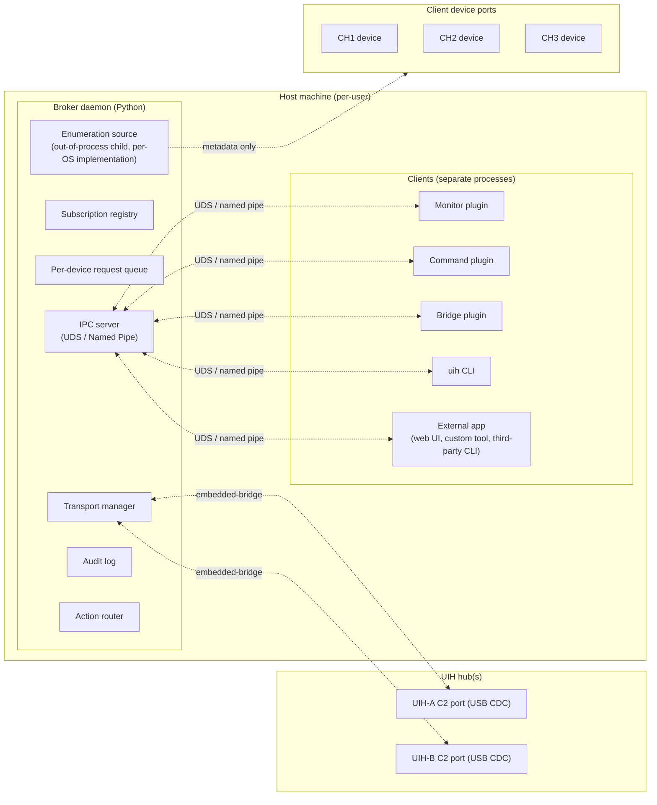

# UIH Broker — Specification

**Status:** Design
**Date:** 2026-04-28
**Author:** Mat (with Claude as design partner)
**Companion document:** [`2026-04-28-uih-broker-design.md`](./2026-04-28-uih-broker-design.md) — wire formats, data shapes, interface contracts, and other implementation-level detail.

This document is the **high-level specification**: context, goals, architectural shape, and the decisions that shape the system. It deliberately stops short of wire-level detail; for that, see the companion design document.

## Table of Contents

- [UIH Broker — Specification](#uih-broker--specification)
  - [Table of Contents](#table-of-contents)
  - [Context](#context)
  - [Goals](#goals)
  - [Non-goals (v1)](#non-goals-v1)
  - [High-level architecture](#high-level-architecture)
    - [Goals → design mapping](#goals--design-mapping)
    - [Topology and bootstrap](#topology-and-bootstrap)
  - [Components (overview)](#components-overview)
  - [Plugin model](#plugin-model)
    - [Self-hosting principle](#self-hosting-principle)
    - [Plugin types](#plugin-types)
    - [Clients vs plugins](#clients-vs-plugins)
    - [Hardware abstraction](#hardware-abstraction)
    - [Trust tiers](#trust-tiers)
  - [Hub readiness gating](#hub-readiness-gating)
  - [Security model overview](#security-model-overview)
    - [v1 — local trust](#v1--local-trust)
    - [v2 (deferred) — capability tokens](#v2-deferred--capability-tokens)
    - [What the broker can and cannot enforce](#what-the-broker-can-and-cannot-enforce)
  - [Migration plan](#migration-plan)
    - [Phase 1 — Broker MVP, macOS-first](#phase-1--broker-mvp-macos-first)
    - [Phase 2 — Linux + Tier 1 SDK](#phase-2--linux--tier-1-sdk)
    - [Phase 3 — Windows + bridge plugins](#phase-3--windows--bridge-plugins)
    - [Phase 4 — Web UI integration](#phase-4--web-ui-integration)
    - [Phase 5 (v2) — Capabilities \& tokens](#phase-5-v2--capabilities--tokens)
  - [Open questions for implementation](#open-questions-for-implementation)
  - [References](#references)

## Context

USB Insight Hub (UIH) software today has three platform-specific paths that solve overlapping problems incompatibly:

- **Windows** — `UIHExtractionService` / `UIH Enumeration Extraction Agent Win` (C#, ~1500 LOC) walks the Win32 USB device tree, parses event-log entries, and forwards display state to the hub's C2 (command-and-control) port.
- **macOS** — `~/e/usb-device/hub_agent.py` watches IOKit hot-plug events, probes ESP32 devices for bootloader mode, and pushes display keepalive to C2. (Mat's usb-device)
- **Linux** — [`Doridian/usb-insight-hub-py`](https://github.com/Doridian/usb-insight-hub-py) by Mark Dietzer (the author of [PR #4](https://github.com/Aeriosolutions/USB-Insight-HUB-Software/pull/4) — host-rendered bitmap display in the main repo) is a standalone Python host application, not a contribution to this repo. It polls sysfs (`/sys/bus/usb/devices/...`) on each render cycle to enumerate, resolves serial port → USB device path via the `tty/` symlink, and pairs USB2/USB3 sides of the dual-bus hub by reading BOS Container ID descriptors. It implements both JSON-RPC (`USBSetPortInfoRequest` / `USBSetPortRequest`) and the binary image protocol (`numDev=11`, 226×90 frames at 1/4/8/16 bpp), runs an internal multi-screen renderer with priority-based cycling, and disables WiFi at startup.

These agents collectively solve the same problem (track which device is on which channel; render that on the hub's screens), but they share no code, no protocol, and no extension surface. They hold the C2 serial port exclusively, which causes contention with developer tools and other services that might want to use the hub — integration tests and utilities that may want to power-cycle client devices or otherwise use the C2 API.

A second project — the [external web UI proposal (issue #21)](https://github.com/Aeriosolutions/USB-Insight-HUB-Software/issues/21) — proposes moving the web UI out of firmware and onto a host-side app talking via WebSerial or WebSocket. That work converges on the same wire protocol the C2 port already speaks (line-delimited JSON-RPC, with binary frames for bitmaps and firmware updates). It strengthens the case for a unified host-side architecture: one wire protocol, multiple transports, multiple clients. A related upstream request — [plugin architecture for firmware and host extensibility (issue #17)](https://github.com/Aeriosolutions/USB-Insight-HUB-Software/issues/17) — directly motivates the host-side plugin SDK in this spec.

This spec describes a **broker daemon** that subsumes the three OS-specific agents, multiplexes C2 access for multiple host-side clients, and exposes a stable plugin SDK so third-party developers can extend the system without touching broker internals.

## Goals

- **One host-side API for the UIH that works the same on all three OSes.** Today, three incompatible OS-specific paths force application authors to choose a platform or write three integrations.
- **Multiple host applications can use a UIH simultaneously.** Today the OS-specific agents hold the hub's C2 port exclusively; only one application can talk to a hub at a time.
- **Tools that need raw direct access keep working.** The unified architecture must not lock developers out of esptool, picocom, dfu-util, or future tooling that operates on the underlying USB/serial paths — both for client devices and (when needed) for C2 itself.
- **Cross-platform enumeration.** "Which device is on which channel" is answered consistently and reliably on all three OSes, including correct USB2/USB3 pairing for the dual-bus hub controller.
- **Third-party developers can extend the system without modifying the core.** A stable public extension surface accommodates new behaviors (logging, automation, alternative transports) so contributions and extensions don't require touching broker internals.
- **Consume our own API.** Non-base broker functionality — display rendering, bootloader detection, type-specific actions, caches — ships as plugins built on the public SDK, not as broker internals. This dogfoods the SDK, validates the API against real workloads, keeps the base runtime minimal, and makes every "smart" behavior replaceable without touching the broker.
- **Security can evolve without breaking compatibility.** The protocol and audit shapes are designed once; future trust controls (per-application permissions, audit enforcement) integrate without wire-format changes.

## Non-goals (v1)

- **Byte-relay for client device ports.** The broker tracks metadata and leases for client-side ports but does not proxy their byte streams.
- **Network-exposed transport.** Local IPC (inter-process communication) only; no TCP or remote access at present.
- **Multi-tenant identity.** Per-user agent on a single-user developer machine.
- **Enforced authentication or per-application permissions.** Reserved for v2; v1 protocol fields are forward-compatible.
- **Custom enumeration providers and pipeline middleware via the extension API.** Deferred to a later milestone.
- **Auto-supervision of extension processes.** Extensions are user-launched; the broker tracks open IPC connections but does not manage extension lifecycle.
- **Firmware-side plugin architecture.** [Issue #17](https://github.com/Aeriosolutions/USB-Insight-HUB-Software/issues/17) envisions both firmware-side (e.g. `UIH_REGISTER_BINARY_CMD` macros, library-based extension built into the ESP32 image) and host-side plugin systems. This document covers only the host side. The two are complementary along the wire protocol — firmware-side extensions surface as new C2 verbs the broker proxies and new event topics it fans out, with no changes to the broker's contract. Firmware-side architecture, registration patterns (Tasmota XDRV-style callback dispatch, ESPHome-style external components, Berry scripting, etc.), and `lib_deps` mechanics are deliberately out of scope here.

## High-level architecture

The broker is the **only process** that holds C2 serial handles. Client device ports (CH1–3) are *not* held open by the broker — clients open them directly. Optionally, clients can coordinate via leases through the broker's IPC (checkout/checkin).

**Communication.** One wire format end-to-end. Clients talk to the broker over **Unix Domain Sockets (UDS)** on macOS / Linux or **Named Pipes** on Windows. Messages are **JSON envelopes** carrying RPC method calls, responses, and events; binary blobs (bitmaps, firmware images, future capture streams) ride in the same byte stream via the [`embedded-bridge`](https://github.com/m-mcgowan/embedded-bridge) message protocol (text + length-prefixed binary on a single channel). The broker speaks the same envelope format upstream to firmware over USB CDC. **No HTTP, no gRPC, no separate REST API** — one transport, one envelope, one library implementation shared between client, broker, and firmware. The full wire-level contract (envelope shape, methods, capability vocabulary, event vocabulary, framing) is in the [design document](./2026-04-28-uih-broker-design.md#wire-protocol).

When firmware later exposes a WebSocket interface to C2 (per [issue #21](https://github.com/Aeriosolutions/USB-Insight-HUB-Software/issues/21)), the broker remains valuable: it still gives clients a single host-side connection, and only one upstream WebSocket is needed per UIH regardless of how many host apps share the hub. Transport selection (USB CDC vs WebSocket vs both with failover) is an internal concern of the transport manager and is invisible to clients.

### Goals → design mapping

| Goal | Design element |
|------|----------------|
| One host-side API on all three OSes | Single Python broker, common wire protocol, OS-specific code confined to enumeration sources and IPC details. Variations between OSs are handled and mitigated by the SDK. |
| Multiple host applications can use a UIH simultaneously | Broker as multiplex point; per-hub FIFO queue; subscription fan-out from one upstream subscription |
| Tools that need raw direct access keep working | `device.checkout` raw lease releases the broker's C2 handle; client device ports are never held by the broker |
| Cross-platform enumeration | First-party enumeration sources, all run as out-of-process child processes — uniform bootstrap and crash-recovery on every OS |
| Third-party developers can extend the system | Plugin SDK, `action.provide`, `events.publish`, schema-driven `self.hub` proxy |
| Security can evolve without breaking compatibility | Forward-compatible envelope (`auth`, `caps_evaluated` reserved); capability vocabulary fixed in v1; audit log shape stable across v1→v2 |

### Topology and bootstrap

The broker is **one process per user** by default — a "master broker" handles all UIHs connected to the host. The enumerator detects hubs and client devices. The broker spawns a **hub worker** for each ready UIH device (see [Hub readiness gating](#hub-readiness-gating) below) and notifies it of enumeration changes for its particular enumeration subtree. Clients connect to the single master socket (`~/.local/state/uih/daemon.sock`) and address hubs by ID in their RPCs. Scripts that monitor or control multiple hubs (CI fixtures, lab dashboards, multi-board test runners) are simpler as a result: one connection and same wire protocol regardless of which hub.

A **hub worker** is the internal per-hub unit: each one owns one UIH's C2 transport, request queue, and lease state. (Display rendering and the firmware-keepalive timer are *not* in the hub worker — they live in a default Command plugin.) In v1, hub workers are async tasks within the master broker process.

**The enumerator is always out-of-process.** On every platform — macOS, Linux, Windows — the enumeration source runs as a child process spawned by the broker, communicating via newline-delimited JSON on its stdout. This gives a uniform architecture: one bootstrap path, one IPC contract, one crash-recovery code path. Native-code crashes (IOKit ctypes, `pyudev`'s C extensions, the Windows C# enumerator's WMI calls) are contained — the broker respawns the enumerator and continues. Equally important, the architecture we build and exercise on macOS/Linux is the same shape that ships on Windows, so the Windows port is primarily a packaging concern rather than an integration concern.

**A `pyserial`-based fallback enumerator** ships alongside the per-OS workers for environments where the per-OS enumerator can't run (exotic platforms, minimal containers, dev VMs). Polling-based, no hot-plug events, no full BOS-pair info — adequate for "the hub is here and driveable," explicitly limited for full UIH topology. See the design document for details.

**Hub workers stay in-process for v1.** With the enumerator already isolated, the question of whether to also subprocess the hub workers becomes a narrower trade-off: subprocess-per-worker only contains bugs inside the worker code path itself (transport, queue, keepalive). The cost — ~500 LOC of subprocess management, internal IPC, two-hop binary payload forwarding, and cross-platform process quirks — is real but bounded. v1 keeps hub workers as async tasks in the master; the architecture is written so subprocess-per-worker is a clean future migration if worker-side bugs become a real source of incidents.

Two future deployment modes are clean refactors of the same hub-worker abstraction, with no wire-protocol changes:

| Mode | When to consider | What changes |
|------|------------------|---------------|
| **Per-hub subprocesses** | Crash containment against worker-side bugs; per-hub resource attribution; per-hub restart without master restart | `broker.process_isolation: true` config; master spawns child process per hub; internal IPC between master and children. |
| **Per-hub scoped sockets** | Convenience for single-hub tools that don't want device-ID arguments on every call | Each hub worker also listens on `daemon-<serial>.sock`; connections there get an implicit `device: <id>` scope on every RPC. Additive to the default socket. |

A more ambitious future direction worth flagging now (so it informs what stays in the worker vs the master): **persistent workers, restart-tolerant master.** Hub workers run as long-lived processes that own the data plane (transport, lease ledger, display state). The master is the control plane (clients, enumeration, routing) and can crash and reconnect to existing workers without disrupting their state. This requires a worker-side reconnect protocol and lease persistence — non-trivial — but gives a meaningfully stronger resilience story than subprocess isolation alone. Out of scope for v1; mentioned here so v1's hub-worker abstraction doesn't preclude it.

**Bootstrap on cold start (high-level):**

1. Master broker starts (MacOS LaunchAgent / Linux systemd `--user` / Run-at-login on Windows).
2. IPC server begins accepting connections immediately.
3. Master starts the OS-specific enumeration source.
4. Enumeration source emits `device-added` events for already-connected hubs.
5. For each enumerated UIH, the master places it in `pending` state and waits for the privileged UIH-detect plugin to populate the canonical hub fields. Once populated, master spawns a hub worker; worker opens C2 and registers with the lease manager.
6. Clients can already use `device.list` and `events.subscribe` from step 2; RPCs targeting a hub are queued until that hub's worker is up.

Hot-plug after bootstrap follows the same readiness flow: `device-added` for a UIH → `pending` → privileged plugin populates → worker spawn → `hub-connected`. Removal is straightforward: the worker stops, in-flight RPCs fail with `device-disconnected`, and leases auto-release.

This makes the enumerator the *bootstrap source of truth*: the set of hub workers is always derived from enumeration events, never from configuration or hard-coded paths.

## Components (overview)

The broker is a small base runtime composed of well-defined components. Each component's responsibility is summarized here; the companion design document defines its full contract.

| Component | Responsibility |
|-----------|----------------|
| **IPC server** | Accept client connections (UDS or named pipe), run handshake, maintain client identity. |
| **Transport manager** | Own one `embedded-bridge` connection per UIH; serial today, WebSocket in future. Detect drops, reconnect. |
| **Per-device request queue** | One FIFO per UIH; strict serialization of C2 requests (firmware lacks correlation IDs). |
| **Subscription registry** | Topic → subscriber routing, with per-client filtering and broker-side fan-out. |
| **Enumeration sources** | OS-specific child processes producing a uniform `(kind, device)` event stream. |
| **Action router** | Dispatch `action.invoke:<name>` calls to the registered provider plugin. |
| **Plugin registry** | Track which connections offer which actions. (No lifecycle management — just routing.) |
| **Audit log** | Structured JSONL of every inbound action, with rotation. |
| **Lease manager** | Connection-scoped leases on hubs and client ports via `device.checkout` / `device.checkin`. |

For wire-level contracts (envelope, methods, capabilities, events, framing), see the design document.

## Plugin model

### Self-hosting principle

The broker is a small base runtime (IPC, transport, queueing, leases, action routing, audit, schema) plus a set of **default plugins** that ship preinstalled and provide the user-visible behaviors most people expect: display rendering, bootloader detection, type-specific actions, location caching. These defaults are built on the same SDK that third parties use — there is no "internal" API that broker-shipped plugins get and external plugins don't.

This dogfooding has three consequences worth being explicit about:

1. **The SDK is exercised by first-party code on day one.** Anything missing from the public API surfaces immediately, while it's cheap to fix.
2. **Defaults are replaceable.** A user who wants different display rendering, or who needs to add board types, doesn't touch broker internals — they disable the default plugin and run their own.
3. **The broker core stays minimal and stable.** "Smart" choices (what does ORANGE on a display mean? how do you put an ESP32 in bootloader?) live in plugins where they're easy to change. The base runtime doesn't churn.

Base vs plugin, summarized:

| Concern | Where |
|---------|-------|
| IPC server, peer auth, connection identity | Base |
| Hub workers (transport, queue, lease state) | Base |
| Enumeration supervisor and per-OS modules | Base |
| Action router, subscription registry | Base |
| Audit log, lease manager | Base |
| Schema introspection (`broker.schema`) | Base |
| UIH detection — VID/PID match, USB2/USB3 BOS pairing, C2 path resolution, populating `uih.*` | **Default privileged Command plugin** (`uih-plugin-detect`) — holds `events.publish.privileged`, ships preinstalled. The broker treats UIHs as `pending` until this plugin populates `uih.c2_path`. |
| Display rendering + 2s firmware-keepalive refresh | **Default Command plugin** (`uih-plugin-display`) |
| Espressif native-USB bootloader detection (SLIP probe → `device-changed`) | **Default Command plugin** (`uih-plugin-espressif-native`) — narrow scope: VID `303A`, the ESP32-S2/S3/C3 native USB-OTG path. |
| Espressif native-USB board actions (`bootloader`, `boot`, `flash`) | **Default Command plugin** (`uih-plugin-espressif-native-tools`) |
| Location cache (offline metadata via `locations.json`) | **Default Monitor plugin** (`uih-plugin-locations`) |
| MQTT/REST/webhook bridges | **Optional Bridge plugins** |
| Custom rendering, custom action providers, board-specific plugins, custom monitors | **User plugins** |

**Why the default plugins are narrowly scoped.** The Espressif plugins target VID `303A` only — the ESP32 family using its native USB-OTG. They explicitly do **not** cover original ESP32 (no native USB), ESP32-S3 boards that route USB through external bridges, or boards with non-standard BOOT/EN wiring. Each of those needs its own plugin, written by whoever cares about those boards. The default plugin is small and reliable precisely because it commits to one well-defined product surface.

Default plugins ship in their own packages alongside the broker (not embedded in the broker core). Installer / package metadata wires them up to autostart so a fresh install behaves equivalently to today's `hub_agent.py` plus what `usb-device` already does. Power users disable, replace, or augment them.

Without any plugins running at all, the broker is still functional: clients can connect, enumerate devices, send arbitrary `hub.read` / `hub.write` RPCs, take leases. Just no displays, no bootloader detection, no canned actions.

### Plugin types

Three plugin types are delivered in v1:

| Type | Description | Example |
|------|-------------|---------|
| **Monitor** | Subscribes to events, reacts externally (logs, files, notifications). Read-only with respect to broker state. | CSV logger of device add/remove; location cache. |
| **Command** | Subscribes + issues C2 commands and/or registers `@action` handlers for client devices. | Auto-flash firmware on bootloader detection; ESP32 type plugin. |
| **Bridge** | Re-exposes the broker's API on another protocol (MQTT, REST, etc.). Bidirectional gateway between broker and another system. | MQTT bridge for home-automation use; REST gateway. |

Custom enumeration providers and pipeline middleware are explicitly v2 — they would each become additional plugin types when implemented.

### Clients vs plugins

A useful distinction: **plugins extend the broker; clients consume it.** Both speak the same wire protocol over the same IPC and use the same SDK — the difference is in role, not in mechanism.

| | What it does | Examples |
|--|--------------|----------|
| **Client** | Consumes the broker's API to do its own thing. Doesn't register `@action` handlers, doesn't publish into the broker's event stream. | The `uih` CLI (ships in v1), an interactive GUI, a one-off script that lists devices, the [Phase 4 web UI](#phase-4--web-ui-integration). |
| **Plugin** | Registers extension surface — handles `@action` calls, publishes `device-changed`, re-exposes the API on another protocol. The default plugins (`uih-plugin-display`, `uih-plugin-detect`, etc.) are first-party plugins. | The Monitor / Command / Bridge taxonomy above. |

**GUIs are clients, not a separate plugin type.** A graphical app that talks to the broker to drive UIHs is the same kind of consumer as the CLI — just with a different presentation layer. If a GUI re-exposes the broker on a different protocol (e.g. a browser-based UI talking to the broker via a localhost WebSocket), the WebSocket adapter portion is a Bridge plugin and the browser app is a client of *that* bridge. The browser doesn't need its own broker connection.

**v1 ships the CLI as the baseline interactive surface.** A GUI is not in v1 core. The Phase 4 web UI (per [issue #21](https://github.com/Aeriosolutions/USB-Insight-HUB-Software/issues/21)) is the natural path; community-built GUIs are equally welcome at any phase. Either way, the contract is the wire protocol — anyone can build a GUI without coordination with the broker maintainers.

### Hardware abstraction

Host plugins never see UIH hardware directly. Every interaction with the hub — setting display content, reading channel state, switching ports, requesting a meter sample, triggering an OTA — happens via broker RPCs that translate to firmware verbs over C2. The broker is the only process holding the hub's serial handle (with `device.checkout` raw-access leases as the documented escape hatch).

This means hardware-level concerns — the SPI bus semaphore between the three displays, the PAC1953 power-monitor I²C timing, AP22653 switch sequencing, USB-OTG stack state — are firmware territory, exposed to host plugins only through stable verbs. Future hardware revisions (different display geometry, additional sensors, different switch IC) change the firmware's verb surface and the `uih.capabilities` metadata; plugins introspect and adapt rather than rewrite.

The corollary: when a plugin needs new behavior the firmware doesn't expose, the right answer is to add a firmware verb (or extend an existing one) rather than reach around the broker. The exceptions — esptool, dfu-util, picocom on the *raw* serial path — exist precisely for the cases where the broker's mediation isn't the answer; the lease/raw-access model handles them cleanly.

### Trust tiers

Three categories of code can write into the device registry, gated by capability:

- **Enumerator** — first-party, OS-specific, runs as a child process. Sets bus-level facts only: `id`, `type` (from VID/PID), `vid`, `pid`, `location`, `serial`, `description`, `bos_container_id`. Stays product-neutral.
- **Privileged plugin** — holds `events.publish.privileged`. May write the **reserved canonical schema fields** documented in the design document (in v1: the `uih` namespace plus `hub_id`, `channel`, `usb_type`). The default `uih-plugin-detect` is the canonical example. Privilege is granted by an installation-manifest declaration; in v1 local trust this is an honor system audited but not enforced, with v2 token-bound enforcement.
- **Standard plugin** — holds `events.publish`. May write `tags`, `product`, and its own `extensions.<namespace>`. Cannot touch reserved canonical fields (broker logs warning + ignores).

This separation is what makes the self-hosting principle work in practice: products like UIH that need canonical first-class data don't smuggle product-specific code into the enumerator, but standard plugins also can't pollute the canonical schema. See [the augmentation rules in the design document](./2026-04-28-uih-broker-design.md#augmentation-by-plugins) for the full merge semantics, the closed reserved-set list, and the audit trail.

## Hub readiness gating

A UIH starts in `pending` state on `device-added`. The privileged plugin probes the device and populates the canonical `uih.*` fields; the broker waits for `uih.c2_path` to appear, then promotes the hub to `ready`, spawns a worker, and emits `hub-connected`. UIHs in bootloader mode never get `uih.c2_path` and stay `pending`.

This gate is the consequence of moving product-specific work out of the enumerator: the broker has no opinion on what makes a hub driveable; it consults the canonical schema, sees `uih.c2_path` populated by a trusted source, and promotes.

See [the design document](./2026-04-28-uih-broker-design.md#hub-readiness-gating) for the full state machine, bootloader-mode disambiguation (running vs bootloader share VID/PID), and edge cases like `device.checkout` while `pending`.

## Security model overview

### v1 — local trust

The broker runs as a single-user agent on a developer machine. The IPC socket is owned by the user (`mode 0600` UDS or per-user named pipe). Connection identity is derived from peer credentials. **All connections implicitly hold the full `*` capability set** — the capability vocabulary is recorded in audit but not enforced. This is intentional: v1's job is to get the protocol shape right and prove the architecture, not to litigate every plugin's intent on a single-user box.

What this buys: a forward-compatible envelope (the `auth` field is reserved from day one), a stable audit-log shape, and a capability vocabulary that captures which operations *would* require what permissions in a multi-tenant world.

### v2 (deferred) — capability tokens

Tokens are minted by the broker, presented at handshake, resolved to a capability set, and enforced on every request. The protocol does not change — `auth: {"token": "..."}` was reserved in v1 — and the audit log starts emitting `denied` outcomes alongside `ok`. Per-device, per-channel, per-action scoping in cap strings makes restrictions arbitrarily fine-grained.

### What the broker can and cannot enforce

The broker enforces capability checks at the `client → broker → device or action` boundary. It cannot prevent raw OS-level device access by a client that holds an advisory lease (this is an OS reality), and it cannot constrain a plugin's behavior inside its own action handlers (plugin authors are trusted; capabilities limit what plugins ask the broker to do, not what they do once they hold a resource).

For the audit log shape and full enforcement-boundary discussion, see the [design document](./2026-04-28-uih-broker-design.md#security-model).

## Migration plan

Phased to land value early; users adopt at their own pace, with existing tools continuing to work throughout the transition.

### Phase 1 — Broker MVP, macOS-first

- Broker daemon: IPC server, transport manager, request queue, subscription registry, audit log, lease manager, enumerator child-process supervisor.
- macOS enumerator: per-OS entry-point module + IOKit ctypes worker (ported from the author's reference implementation). Common supervisor reused on Linux/Windows.
- Default plugins shipped: privileged `uih-plugin-detect` (canonical privileged-plugin example), `uih-plugin-display`, `uih-plugin-espressif-native`. Each is a few-tens-of-LOC plugin built on the same SDK third parties will use; the privileged-plugin tier exists from day one.
- Tier 2 SDK (`BrokerClient`).
- LaunchAgent install.

Outcome: macOS users gain multi-client C2 access. The out-of-process enumerator architecture is exercised end-to-end from day one — the same shape that ships on every later platform.

### Phase 2 — Linux + Tier 1 SDK

- Linux enumerator: `pyudev` + sysfs reads; emits `bos_container_id` (privileged plugin pairs USB2/USB3 halves).
- systemd `--user` unit.
- Tier 1 SDK (`Plugin`, `@on`, `@action`, action registry).
- Reference Monitor and Command plugins (CSV logger, ESP32 tools).

Outcome: cross-OS broker; plugin authoring is real. Bootstrap and IPC code paths are identical to Phase 1; only the enumerator binary differs.

### Phase 3 — Windows + bridge plugins

- Windows broker daemon (Python on Windows, packaged via PyInstaller).
- Windows enumerator: refactored C# binary (`UIHEnumerator.exe`) with UIH-specific matching/pairing stripped — those move to the privileged plugin. C# binary emits `bos_container_id`; same privileged plugin pairs as on macOS/Linux.
- Per-user run-at-login + optional Windows service install.
- Bridge-plugin scaffold and reference adapter (MQTT or REST).

Outcome: tri-platform parity. Windows is primarily a packaging effort because the architecture has been exercised since Phase 1.

### Phase 4 — Web UI integration

- The web UI from [issue #21](https://github.com/Aeriosolutions/USB-Insight-HUB-Software/issues/21) gains broker as a connection target (alongside WebSerial direct).
- Broker exposes its IPC over a localhost WebSocket for browser clients.

Outcome: external web UI converges on the broker. Standalone OS-specific extraction tools are no longer needed for users running the broker, but remain available for users who don't.

### Phase 5 (v2) — Capabilities & tokens

- Token issuance + storage.
- Capability enforcement.
- Policy engine (`privileged_default`, etc.).
- `uih token` CLI subcommand.

## Open questions for implementation

Items still to settle when implementation starts; they don't block the architecture:

1. **Schema language for `broker.schema`.** Hand-rolled JSON is enough for v1(decided); if/when we add codegen for IDE stubs, formalizing as a JSON Schema fragment may be worth it. Keeping simple in v1.
2. **Broker config format.** **YAML** (decided; `~/.config/uih/broker.yaml`).
3. **Plugin discovery for v2.** v1 has no auto-discovery (plugins are just scripts the user runs); keep simple in v1. v2 might add a manifest-driven supervised mode (`~/.config/uih/plugins/*.yaml`).
4. **Schema versioning at the verb level.** Per-verb version field (`hub.write.v2`) vs envelope-level only. Per-verb is more granular but adds complexity. v1: envelope-level only.
5. **Test strategy.** Mock broker in `uih-sdk` for plugin authors; integration tests use the real broker against a test UIH.
6. **Hot reload of broker config.** `broker.reload` is exposed as a method but the scope of what it can change without restart is TBD. Likely subset for v1: display rules, audit verbosity, log paths. Plugins observing config changes that affect them (e.g. a render-cadence change) may opt to restart themselves; the broker doesn't force-restart plugins.
7. **Enumerator crash recovery.** Backoff/restart policy on the enumerator child process. How to surface "enumeration is degraded" to clients while waiting for restart (probably `broker-error` event with a reason code, plus stale-marking of the device list returned by `device.list`). Same policy on all platforms.

> Note: an earlier draft listed "multi-broker on one machine" as an option for lab environments. Removed — one broker handles all UIHs on the host, which is sufficient for every concrete use case identified.

## References

- [Companion design document](./2026-04-28-uih-broker-design.md) — wire formats, data shapes, interface contracts.
- [Issue #21 — Proposal: External Web UI](https://github.com/Aeriosolutions/USB-Insight-HUB-Software/issues/21) — converging web UI proposal that the broker enables (see [Context](#context) and [Phase 4](#phase-4--web-ui-integration)). Also tracked locally as `docs/proposal-external-webui.md`.
- [Issue #17 — Plugin architecture for firmware and host extensibility](https://github.com/Aeriosolutions/USB-Insight-HUB-Software/issues/17) — upstream feature request that directly motivates the host-side plugin SDK in this document.
- The author's standalone `usb-device` repo — prior macOS hub agent referenced as prior art.
- [`Doridian/usb-insight-hub-py`](https://github.com/Doridian/usb-insight-hub-py) — standalone Linux host (sysfs-polling enumeration, JSON-RPC + binary image protocol).
- [PR #4 — Aeriosolutions/USB-Insight-HUB-Software](https://github.com/Aeriosolutions/USB-Insight-HUB-Software/pull/4) — Doridian's host-rendered bitmap display proposal in the main repo.

For implementation references (firmware C2 RPC, embedded-bridge wire protocol, existing Windows C# code), see the design document.
